# Magicodes.IE | [简体中文](README.zh-CN.md)
[](https://github.com/dotnetcore)
[](https://www.nuget.org/packages/Magicodes.IE.Core) 
[](https://dev.azure.com/xinlaiopencode/Magicodes.IE/_build/latest?definitionId=4&branchName=master)
[](https://www.nuget.org/stats/packages/Magicodes.IE.Core?groupby=Version)
[](https://github.com/dotnetcore/Magicodes.IE/blob/master/LICENSE)

[](https://starchart.cc/dotnetcore/Magicodes.IE)


[](https://opencollective.com/magicodes) 

## Overview

Import and export general library, support Dto import and export, template export, fancy export and dynamic export, support Excel, Csv, Word, Pdf and Html.

**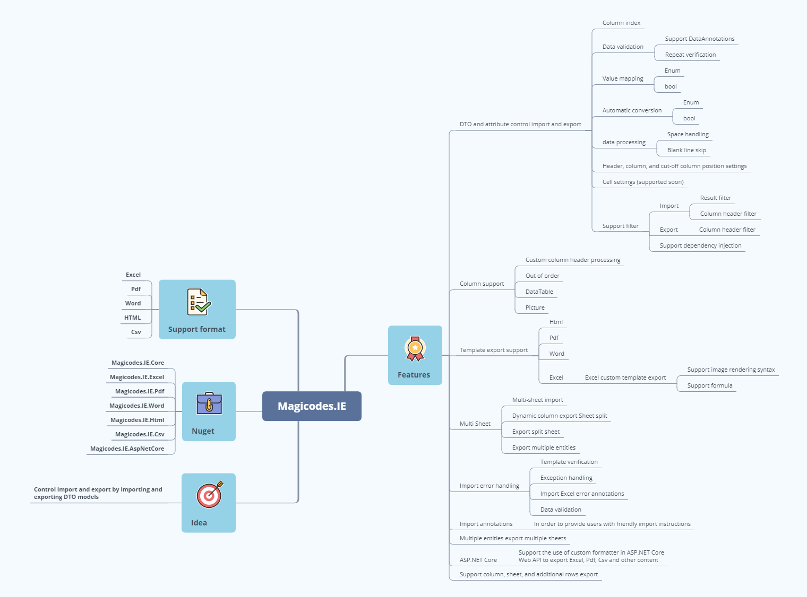**

### Azure DevOps
- Build Status：[](https://dev.azure.com/xinlaiopencode/Magicodes.IE/_build/latest?definitionId=4&branchName=master)
- Azure DevOps coverage (master):  
- Azure DevOps tests (master):  

For details, see: <https://dev.azure.com/xinlaiopencode/Magicodes.IE/_build?definitionId=4&_a=summary>

### NuGet

#### Stable version (recommended)

| **Name** | **NuGet** |
|----------|:-------------|
| **Magicodes.IE.Core** | **[](https://www.nuget.org/packages/Magicodes.IE.Core)** |
| **Magicodes.IE.Excel** | **[](https://www.nuget.org/packages/Magicodes.IE.Excel)**   |
| **Magicodes.IE.Excel.NPOI** | **[](https://www.nuget.org/packages/Magicodes.IE.Excel.NPOI)**   |
| **Magicodes.IE.Excel.AspNetCore** | **[](https://www.nuget.org/packages/Magicodes.IE.Excel.AspNetCore)**   |
| **Magicodes.IE.Pdf** | **[](https://www.nuget.org/packages/Magicodes.IE.Pdf)**   |
| **Magicodes.IE.Word** | **[](https://www.nuget.org/packages/Magicodes.IE.Word)**   |
| **Magicodes.IE.Html** | **[](https://www.nuget.org/packages/Magicodes.IE.Html)**   |
| **Magicodes.IE.Csv** | **[](https://www.nuget.org/packages/Magicodes.IE.Csv)**   |
| **Magicodes.IE.AspNetCore** | **[](https://www.nuget.org/packages/Magicodes.IE.AspNetCore)**   |
| **Magicodes.IE.EPPlus** | **[](https://www.nuget.org/packages/Magicodes.IE.EPPlus)**   |
| **Magicodes.IE.Excel.Abp** | **[](https://www.nuget.org/packages/Magicodes.IE.Excel.Abp)**   |
| **Magicodes.IE.Csv.Abp** | **[](https://www.nuget.org/packages/Magicodes.IE.Csv.Abp)**   |
| **Magicodes.IE.Html.Abp** | **[](https://www.nuget.org/packages/Magicodes.IE.Html.Abp)**   |
| **Magicodes.IE.Pdf.Abp** | **[](https://www.nuget.org/packages/Magicodes.IE.Pdf.Abp)**   |
| **Magicodes.IE.Word.Abp** | **[](https://www.nuget.org/packages/Magicodes.IE.Word.Abp)**   |
| **Magicodes.IE.Stash** | **[](https://www.nuget.org/packages/Magicodes.IE.Stash)**   |

### **Note**

- Excel import does not support ".xls" files, that is, Excel97-2003 is not supported. 
- For use in Docker, please refer to the section "Use in Docker" in the documentation. 
- Relevant functions have been compiled with unit tests. You can refer to unit tests during the use process. 

### **Tutorial**

1. <a href="docs/1.Basic tutorial of importing student data.md">Basic tutorial of importing student data</a>
2. <a href="docs/2.Basic tutorial of export Excel.md">Basic tutorial of export Excel</a>
3. <a href="docs/3.Basic tutorial of export Pdf receipts.md">Basic tutorial of export Pdf receipts</a>
4. <a href="docs/4.Use in Docker.md">Use in Docker</a>
5. <a href="docs/5.Dynamic Export.md">Dynamic Export</a>
6. <a href="docs/6.Import Multi-Sheet Tutorial.md">Import Multi-Sheet Tutorial</a>
7. <a href="docs/8. Import and export Excel as pictures.md">Import and export Excel as pictures</a>
8. <a href="docs/9.Excel template export-Export textbook order form .md">Excel template export-Export textbook order form</a>
9. <a href="docs/Excel Merge Row Cells Import.md">Excel Merge Row Cells Import</a>
12. <a href="docs/12.Exporting multiple formats in NETCore via request headers.md">Exporting multiple formats in NETCore via request headers</a>
13. <a href="docs/13.Performance Measurement.md">Performance Measurement</a>
14. <a href="docs/Excel Merge Row Cells Import.md">Excel Merge Row Cells Import</a>
15. <a href="docs/Excel template  export - dynamic export.md">Excel template  export - dynamic export</a>

**See below for other tutorials or unit tests**

**See below for update history.**

## Features

- **Need to be used in conjunction with related import and export DTO models, support import and export through DTO and related characteristics. Configure features to control related logic and display results without modifying the logic code;**
**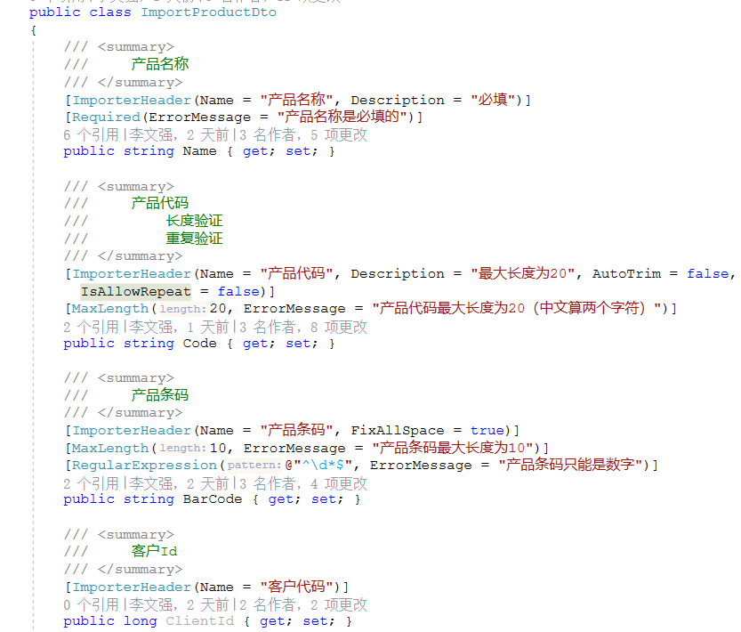**
- **Support various filters to support scenarios such as multi-language, dynamic control column display, etc. For specific usage, see unit test:**
  - **Import column header filter <IImportHeaderFilter>(you can dynamically specify the imported column and imported value mapping relationship)**
  - **Export column header filter <IImportHeaderFilter>(can dynamically control the export column, support dynamic export (DataTable))**
  - **Export column headers filter <IImportHeadersFilter>(can dynamically control the export column, support dynamic export (DataTable))**
  - **Import result filter <IImportResultFilter>(can modify annotation file)**
- **Export supports text custom filtering or processing;**
- **Import supports automatic skipping of blank lines in the middle;**
- **Import supports automatically generate import templates based on DTO, and automatically mark required items;**
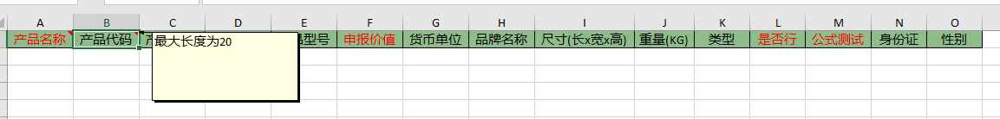
- **Import supports data drop-down selection, currently only supports enumerated types;**
- **Imported data supports the processing of leading and trailing spaces and intermediate spaces, allowing specific columns to be set;**
- **Import supports automatic template checking, automatic data verification, unified exception handling, and unified error encapsulation, including exceptions, template errors and row data errors;**

- **Support import header position setting, the default is 1;**
- **Support import columns out of order, no need to correspond one to one in order;**
- **Support to import the specified column index, automatic recognition by default;**
- **Exporting Excel supports splitting of Sheets, only need to set the value of [MaxRowNumberOnASheet] of the characteristic [ExporterAttribute]. If it is 0, no splitting is required. See unit test for details;**
- **Support importing into Excel for error marking;**


- **Import supports cutoff column setting, if not set, blank cutoff will be encountered by default;**
- **Support exporting HTML, Word, Pdf, support custom export template;**
  -**Export HTML**

  -**Export Word**
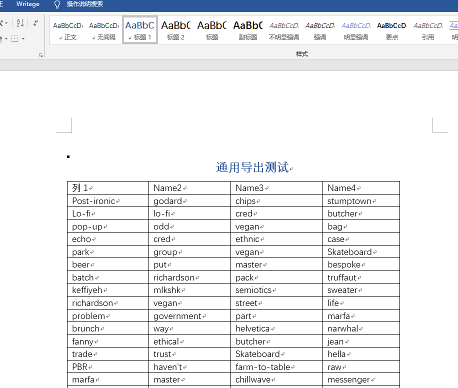
  -**Export Pdf, support settings, see the update log for details**
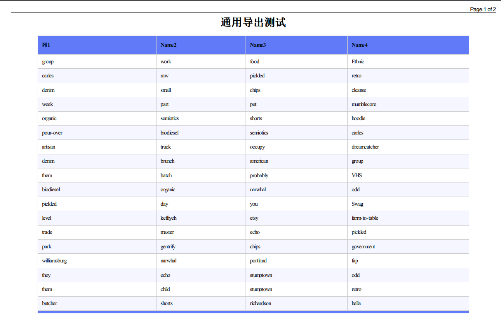
  -**Export receipt**

- **Import supports repeated verification;**
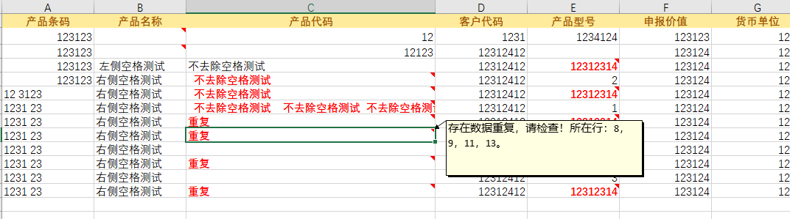
- **Support single data template export, often used to export receipts, credentials and other businesses**
- **Support dynamic column export (based on DataTable), and the Sheet will be split automatically if it exceeds 100W. (Thanks to teacher Zhang Shanyou ([https://github.com/xin-lai/Magicodes.IE/pull/8](https://github.com/xin-lai/Magicodes.IE/pull/8) ))* *
- **Support dynamic/ExpandoObject dynamic column export**
```csharp
        [Fact(DisplayName = "DTO export supports dynamic types")]
        public async Task ExportAsByteArraySupportDynamicType_Test()
        {
            IExporter exporter = new ExcelExporter();

            var filePath = GetTestFilePath($"{nameof(ExportAsByteArraySupportDynamicType_Test)}.xlsx");

            DeleteFile(filePath);

            var source = GenFu.GenFu.ListOf<ExportTestDataWithAttrs>();
            string fields = "text,number,name";
            var shapedData = source.ShapeData(fields) as ICollection<ExpandoObject>;

            var result = await exporter.ExportAsByteArray<ExpandoObject>(shapedData);
            result.ShouldNotBeNull();
            result.Length.ShouldBeGreaterThan(0);
            File.WriteAllBytes(filePath, result);
            File.Exists(filePath).ShouldBeTrue();
        }
```
- **Support value mapping, support setting value mapping relationship through "ValueMappingAttribute" feature. It is used to generate data validation constraints for import templates and perform data conversion. **
```csharp
        /// <summary>
        /// Gender
        /// </summary>
        [ImporterHeader(Name = "Gender")]
        [Required(ErrorMessage = "Gender cannot be empty.")]
        [ValueMapping(text: "Male", 0)]
        [ValueMapping(text: "Female", 1)]
        public Genders Gender { get; set; }
```

- **Support the generation of imported data verification items of enumeration and Bool type, and related data conversion**
	- **Enumeration will automatically obtain the description, display name, name and value of the enumeration by default to generate data items**

		```csharp
			/// <summary>
			/// Student Status
			/// </summary>
			public enum StudentStatus
			{
				/// <summary>
				/// Normal
				/// </summary>
				[Display(Name = "正常")]
				Normal = 0,

				/// <summary>
				/// Pupils away
				/// </summary>
				[Description("流水")]
				PupilsAway = 1,

				/// <summary>
				/// Suspension
				/// </summary>
				[Display(Name = "休学")]
				Suspension = 2,

				/// <summary>
				/// Work-study
				/// </summary>
				[Display(Name = "勤工俭学")]
				WorkStudy = 3,

				/// <summary>
				/// Internships
				/// </summary>
				[Display(Name = "顶岗实习")]
				PostPractice = 4,

				/// <summary>
				/// Graduate
				/// </summary>
				[Display(Name = "毕业")]
				Graduation = 5,

				/// <summary>
				/// Join the army
				/// </summary>
				[Display(Name = "参军")]
				JoinTheArmy = 6,
			}
		```

		

	- **The bool type will generate "yes" and "no" data items by default**
	- **If custom value mapping has been set, no default options will be generated**

- **Support excel multi-sheet import**
  **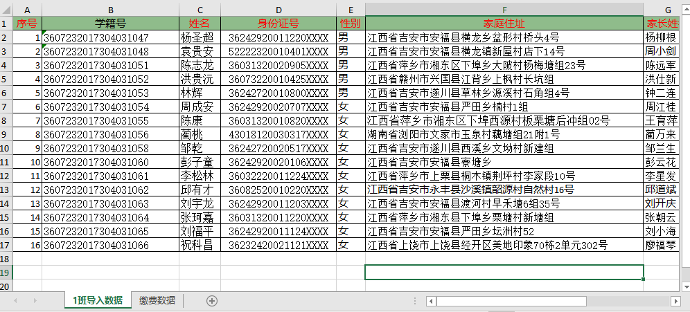**

- **Support Excel template export, and support image rendering**
  ****

  The rendering syntax is as follows:

  ```
    {{Company}}  //Cell rendering
    {{Table>>BookInfos|RowNo}} //Table rendering start syntax
    {{Remark|>>Table}}//Table rendering end syntax
    {{Image::ImageUrl?Width=50&Height=120&Alt=404}} //Picture rendering
    {{Image::ImageUrl?w=50&h=120&Alt=404}} //Picture rendering
    {{Image::ImageUrl?Alt=404}} //Picture rendering
  ```

  Custom pipelines will be supported in the future.

- **Support Excel import template to generate annotation**
  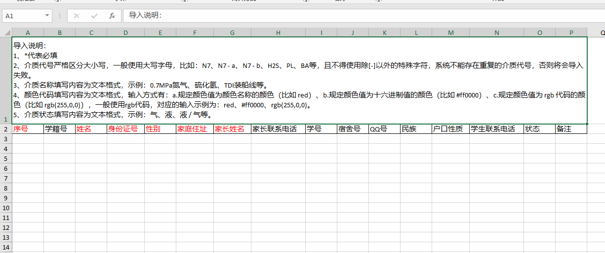

- **Support Excel image import and export**
  - Picture import
    - Import as Base64
    - Import to temporary directory
    - Import to the specified directory
   - Picture export
    - Export file path as picture
    - Export network path as picture

- **Support multiple entities to export multiple Sheets**

- **Support using some features under the System.ComponentModel.DataAnnotations namespace to control import and export** [#63](https://github.com/dotnetcore/Magicodes.IE/issues/63)

- **Support the use of custom formatter in ASP.NET Core Web API to export content such as Excel, Pdf, Csv** [#64](https://github.com/dotnetcore/Magicodes.IE/issues/64 )

- **Support export by column, sheet, and additional rows** 

```csharp
exporter.Append(list1).SeparateByColumn().Append(list2).ExportAppendData(filePath);
```

For details, see the above tutorial "Magicodes.IE Fancy Export"

- **Support cell export width setting**

```csharp
[ExporterHeader(Width = 100)]
public DateTime Time3 { get; set; }
```

- **Excel export supports HeaderRowIndex. Add the HeaderRowIndex attribute to the ExcelExporterAttribute export attribute class, so that it is convenient to specify the export from the first row when exporting. **

- **Excel generated import template supports built-in data verification**

The support for the built-in data validation can be turned on through the IsInterValidation attribute, and it should be noted that only MaxLengthAttribute, MinLengthAttribute, StringLengthAttribute, and RangeAttribute support the opening operation of the built-in data validation.

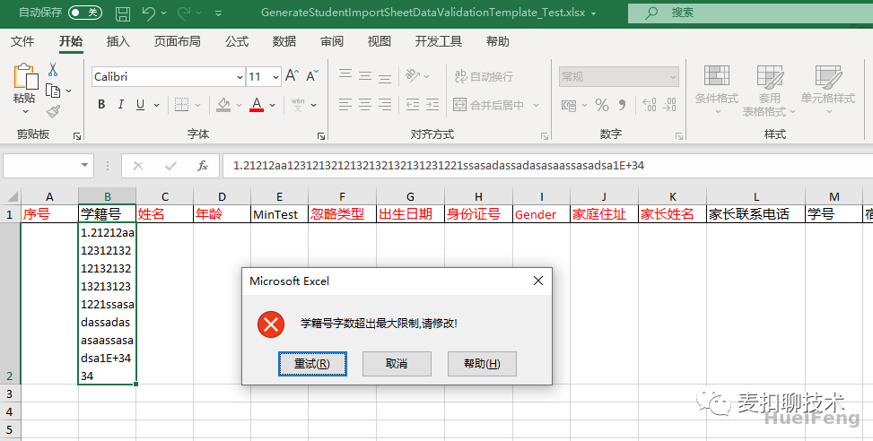
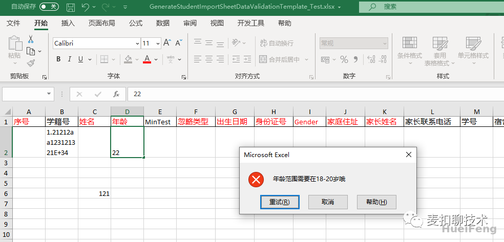

Support display operations for input prompts:
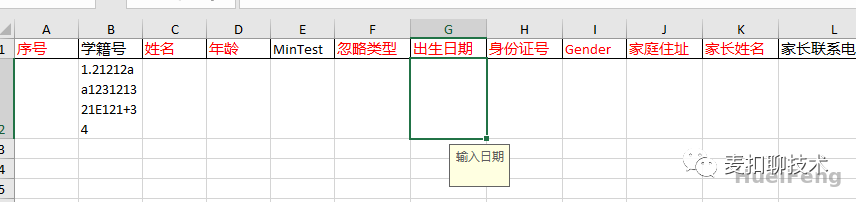

- **Excel import supports merging row data** [#239](https://github.com/dotnetcore/Magicodes.IE/issues/239)

 

- Add packaging for Abp module, see [#318](https://github.com/dotnetcore/Magicodes.IE/issues/318) for details.

### FAQ

[Question List](https://github.com/dotnetcore/Magicodes.IE/issues?q=label%3Aquestion)

### **Update history**

**[Update history](RELEASE.md)**

## Contributors

### Code Contributors

This project exists thanks to all the people who contribute. [[Contribute](CONTRIBUTING.md)].
<a href="https://github.com/dotnetcore/Magicodes.IE/graphs/contributors"></a>

### Financial Contributors

Become a financial contributor and help us sustain our community. [[Contribute](https://opencollective.com/magicodes/contribute)]

#### Individuals

<a href="https://opencollective.com/magicodes"></a>

#### Organizations

Support this project with your organization. Your logo will show up here with a link to your website. [[Contribute](https://opencollective.com/magicodes/contribute)]

<a href="https://opencollective.com/magicodes/organization/0/website"></a>
<a href="https://opencollective.com/magicodes/organization/1/website"></a>
<a href="https://opencollective.com/magicodes/organization/2/website"></a>
<a href="https://opencollective.com/magicodes/organization/3/website"></a>
<a href="https://opencollective.com/magicodes/organization/4/website"></a>
<a href="https://opencollective.com/magicodes/organization/5/website"></a>
<a href="https://opencollective.com/magicodes/organization/6/website"></a>
<a href="https://opencollective.com/magicodes/organization/7/website"></a>
<a href="https://opencollective.com/magicodes/organization/8/website"></a>
<a href="https://opencollective.com/magicodes/organization/9/website"></a>
