# Magicodes.IE

导入导出通用库，通过导入导出DTO模型来控制导入和导出，支持Excel、Word、Pdf和Html。

[](https://dev.azure.com/xinlaiopencode/Magicodes.IE/_build/latest?definitionId=4&branchName=master)

### 注意

- Excel导入不支持“.xls”文件，即不支持Excel97-2003。
- Pdf导出暂不支持.NET Framework。
- 如需在Docker中使用，请参阅文档中的《Docker中使用》一节。
- 相关功能均已编写单元测试，在使用的过程中可以参考单元测试。
- 此库会长期支持，但是由于精力有限，希望大家能够多多参与。

### 教程

1. [基础教程之导入学生数据](docs/1.基础教程之导入学生数据.md "1.基础教程之导入学生数据")  （[点此访问国内文档](https://docs.xin-lai.com/2019/11/26/%E7%BB%84%E4%BB%B6/Magicodes.IE/1.%E5%9F%BA%E7%A1%80%E6%95%99%E7%A8%8B%E4%B9%8B%E5%AF%BC%E5%85%A5%E5%AD%A6%E7%94%9F%E6%95%B0%E6%8D%AE/)）

2. 基础教程之导出Excel（待补充）

3. 基础教程之导出Pdf收据（待补充）

4. 在Docker中使用（待补充）

5. 动态导出（待补充）

6. 多Sheet导入（待补充）

7. Excel模板导出之导出教材订购表（待补充）

8. 其他教程见下文或单元测试

   

### 特点


- 需配合相关导入导出的DTO模型使用，支持通过DTO以及相关特性控制导入导出。配置特性即可控制相关逻辑和显示结果，无需修改逻辑代码；

- 导出支持列头自定义处理以便支持多语言等场景；
- 导出支持文本自定义过滤或处理；
- 导入支持中间空行自动跳过；
- 导入支持自动根据 DTO 生成导入模板,针对必填项将自动标注；

- 导入支持数据下拉选择，目前仅支持枚举类型；
- 导入数据支持前后空格以及中间空格处理，允许指定列进行设置；
- 导入支持模板自动检查，数据自动校验，异常统一处理，并提供统一的错误封装，包含异常、模板错误和行数据错误；

- 支持导入表头位置设置，默认为1；
- 支持导入列乱序，无需按顺序一一对应；
- 支持导入指定列索引，默认自动识别；
- 支持将导入Excel进行错误标注；


- 导入支持截止列设置，如未设置则默认遇到空格截止；
- 支持导出HTML、Word、Pdf，支持自定义导出模板；
  - 导出HTML

  - 导出Word

  - 导出Pdf，支持设置，具体见更新日志

  - 导出收据

- 导入支持重复验证；

- 支持单个数据模板导出，常用于导出收据、凭据等业务
- 支持动态列导出（基于DataTable），并且超过100W将自动拆分Sheet。（感谢张善友老师（https://github.com/xin-lai/Magicodes.IE/pull/8））
- 支持值映射，支持通过“ValueMappingAttribute”特性设置值映射关系。用于生成导入模板的数据验证约束以及进行数据转换。
````C#
        /// <summary>
        ///     性别
        /// </summary>
        [ImporterHeader(Name = "性别")]
        [Required(ErrorMessage = "性别不能为空")]
        [ValueMapping(text: "男", 0)]
        [ValueMapping(text: "女", 1)]
        public Genders Gender { get; set; }
````

- 支持枚举和Bool类型的导入数据验证项的生成，以及相关数据转换
	- 枚举默认情况下会自动获取枚举的描述、显示名、名称和值生成数据项

		````C#
			/// <summary>
			/// 学生状态 正常、流失、休学、勤工俭学、顶岗实习、毕业、参军
			/// </summary>
			public enum StudentStatus
			{
				/// <summary>
				/// 正常
				/// </summary>
				[Display(Name = "正常")]
				Normal = 0,

				/// <summary>
				/// 流失
				/// </summary>
				[Description("流水")]
				PupilsAway = 1,

				/// <summary>
				/// 休学
				/// </summary>
				[Display(Name = "休学")]
				Suspension = 2,

				/// <summary>
				/// 勤工俭学
				/// </summary>
				[Display(Name = "勤工俭学")]
				WorkStudy = 3,

				/// <summary>
				/// 顶岗实习
				/// </summary>
				[Display(Name = "顶岗实习")]
				PostPractice = 4,

				/// <summary>
				/// 毕业
				/// </summary>
				[Display(Name = "毕业")]
				Graduation = 5,

				/// <summary>
				/// 参军
				/// </summary>
				[Display(Name = "参军")]
				JoinTheArmy = 6,
			}
		````

		

	- bool类型默认会生成“是”和“否”的数据项
	- 如果已设置自定义值映射，则不会生成默认选项
- 支持excel多Sheet导入；
  

### 相关官方Nuget包

| 名称     |      Nuget      |
|----------|:-------------:|
| Magicodes.IE.Core  |  [](https://www.nuget.org/packages/Magicodes.IE.Core) |
| Magicodes.IE.Excel |    [](https://www.nuget.org/packages/Magicodes.IE.Excel)   |
| Magicodes.IE.Pdf |    [](https://www.nuget.org/packages/Magicodes.IE.Pdf)   |
| Magicodes.IE.Word |    [](https://www.nuget.org/packages/Magicodes.IE.Word)   |
| Magicodes.IE.Html |    [](https://www.nuget.org/packages/Magicodes.IE.Html)   |

### VNext

> 以下内容均已有思路，但是缺乏精力，因此虚席待PR，有兴趣的朋友可以参与进来，多多交流。

- [ ] 将代码单元测试覆盖率提高到90%（目前为86%）
- [ ] Pdf导出支持.NET Framework 461
- [ ] 完成自动构建流程，并通过自动构建发包
- [ ] 表头样式设置
- [ ] 自定义模板导出
  - [ ] Excel （[#10](https://github.com/dotnetcore/Magicodes.IE/issues/10)）
- [ ] 加强值映射序列，比如支持方法、Dto接口的方式来获取
- [ ] 生成导入模板时必填项支持自定义样式配置
- [ ] CSV支持
- [ ] 导入结果支持生成HTML输出
- [ ] Sheet拆分（有兴趣的朋友可以参考张队的PR：https://github.com/xin-lai/Magicodes.IE/pull/14）
- [ ] Excel导出支持图片
- [ ] 解决Excel导出无法进行数据筛选的问题（[#17](https://github.com/dotnetcore/Magicodes.IE/issues/17)）
- [ ] Excel单元格自动合并（[#9](https://github.com/dotnetcore/Magicodes.IE/issues/9)）
- [ ] 导入导出支持指定位置[CellAddress(Row = 2, Column = 2)]（[#19](https://github.com/dotnetcore/Magicodes.IE/issues/19)）
- [ ] 生成的导入模板支持数据验证
- [ ] 优化包依赖，拆解项目

### 联系我们

> ##### 订阅号

关注“麦扣聊技术”订阅号可以获得最新文章、教程、文档：


> ##### QQ群

- 编程交流群<85318032>

- 产品交流群<897857351>

> ##### 文档官网&官方博客

- 文档官网：<https://docs.xin-lai.com/>
- 博客：<http://www.cnblogs.com/codelove/>


> ##### 其他开源库

- <https://github.com/xin-lai>
- <https://gitee.com/magicodes>


### 更新历史

#### 2019.01.07
- 【Nuget】版本更新到1.4.17
- 【重构】重构IExportFileByTemplate中的ExportByTemplate，将参数htmlTemplate改为template。以便支持Excel模板导出。
- 【导出】支持Excel模板导出并填写相关单元测试，如何使用见教程《Excel模板导出之导出教材订购表》
    - 支持单元格单个绑定
    - 支持列表


#### 2019.12.17
- 【Nuget】版本更新到1.4.16
- 【导入】Excel导入支持多sheet导入，感谢tanyongzheng（https://github.com/dotnetcore/Magicodes.IE/pull/18 ）

#### 2019.12.10
- 【Nuget】版本更新到1.4.15
- 【测试】单元测试添加多框架版本支持 (<https://docs.xin-lai.com/2019/12/10/%E6%8A%80%E6%9C%AF%E6%96%87%E6%A1%A3/Magicodes.IE%E7%BC%96%E5%86%99%E5%A4%9A%E6%A1%86%E6%9E%B6%E7%89%88%E6%9C%AC%E6%94%AF%E6%8C%81%E5%92%8C%E6%89%A7%E8%A1%8C%E5%8D%95%E5%85%83%E6%B5%8B%E8%AF%95/>)
- 【修复】修复部分.NET Framework 461下的问题

#### 2019.12.06
- 【Nuget】版本更新到1.4.14
- 【重构】大量重构
	- 移除部分未使用的代码
	- 将TemplateFileInfo重命名为ExportFileInfo
	- 将IExporterByTemplate接口拆分为4个接口：IExportListFileByTemplate, IExportListStringByTemplate, IExportStringByTemplate, IExportFileByTemplate，并修改相关实现
	- 重构ImportHelper部分代码
- 【导入】修复导入Excel时表头设置的问题，已对此编写单元测试，见【产品信息导入】
- 【完善】编写ExportAsByteArray对于DataTable的单元测试，ExportWordFileByTemplate_Test

#### 2019.11.25
- 【Nuget】版本更新到1.4.13
- 【导出】Pdf导出支持特性配置，详见单元测试【导出竖向排版收据】。目前主要支持以下设置：
	- Orientation：排版方向（横排、竖排）
	- PaperKind：纸张类型，默认A4
	- IsEnablePagesCount：是否启用分页数
	- Encoding：编码设置，默认UTF8
	- IsWriteHtml：是否输出HTML模板，如果启用，则会输出.html后缀的对应的HTML文件，方便调错
	- HeaderSettings：头部设置，通常可以设置头部的分页内容和信息
	- FooterSettings：底部设置

#### 2019.11.24
- 【Nuget】版本更新到1.4.12
- 【导出】导出动态类支持超过100W数据时自动拆分Sheet（具体见PR：https://github.com/xin-lai/Magicodes.IE/pull/14）

#### 2019.11.20
- 【Nuget】版本更新到1.4.11
- 【导出】修复Datatable列的顺序和DTO的顺序不一致，导致数据放错列（具体见PR：https://github.com/xin-lai/Magicodes.IE/pull/13）

#### 2019.11.16
- 【Nuget】版本更新到1.4.10
- 【导出】修复Pdf导出在多线程下的问题

#### 2019.11.13
- 【Nuget】版本更新到1.4.5
- 【导出】修复导出Pdf在某些情况下可能会导致内存报错的问题
- 【导出】添加批量导出收据单元测试示例，并添加大量数据样本进行测试

#### 2019.11.5
- 【Nuget】版本更新到1.4.4
- 【导入】修复枚举类型的问题，并编写单元测试
- 【导入】增加值映射，支持通过“ValueMappingAttribute”特性设置值映射关系。用于生成导入模板的数据验证约束以及进行数据转换。
- 【导入】优化枚举和Bool类型的导入数据验证项的生成，以便于模板生成和数据转换
	- 枚举默认情况下会自动获取枚举的描述、显示名、名称和值生成数据项
	- bool类型默认会生成“是”和“否”的数据项
	- 如果已设置自定义值映射，则不会生成默认选项
- 【导入】支持枚举可为空类型

#### 2019.10.30
- 【Nuget】版本更新到1.4.0
- 【导出】Excel导出支持动态列导出（基于DataTable），感谢张善友（https://github.com/xin-lai/Magicodes.IE/pull/8）

#### 2019.10.22
- 【Nuget】版本更新到1.3.7
- 【导入】修复忽略列的验证问题
- 【导入】修正验证错误信息，一行仅允许存在一条数据
- 【导入】修复忽略列在某些情况下可能引发的异常
- 【导入】添加存在忽略列的导入情形下的单元测试

#### 2019.10.21
- 【Nuget】版本更新到1.3.4
- 【导入】支持设置忽略列，以便于在Dto定义数据列做处理或映射

#### 2019.10.18
- 【优化】优化.NET标准库2.1下集合转DataTable的性能
- 【重构】多处IList<T>修改为ICollection<T>
- 【完善】补充部分单元测试

#### 2019.10.12
- 【重构】重构HTML、PDF导出等逻辑，并修改IExporterByTemplate为：
  - Task<string> ExportListByTemplate<T>(IList<T> dataItems, string htmlTemplate = null) where T : class;
  - Task<string> ExportByTemplate<T>(T data, string htmlTemplate = null) where T : class;
- 【示例】添加收据导出的单元测试示例


#### 2019.9.28
- 【导出】修改默认的导出HTML、Word、Pdf模板
- 【导入】添加截断行的单元测试，以测试中间空格和结尾空格
- 【导入】将【数据错误检测】和【导入】单元测试的Dto分开，确保全部单元测试通过
- 【文档】更新文档

#### 2019.9.26
- 【导出】支持导出Word、Pdf、HTML，支持自定义导出模板
- 【导出】添加相关导出的单元测试
- 【导入】支持重复验证，需设置ImporterHeader特性的IsAllowRepeat为false

#### 2019.9.19
- 【导入】支持截止列设置，如未设置则默认遇到空格截止
- 【导入】导入支持通过特性设置Sheet名称

#### 2019.9.18

- 【导入】重构导入模块
- 【导入】统一导入错误消息
	- Exception ：导入异常信息
	- RowErrors ： 数据错误信息
	- TemplateErrors ：模板错误信息，支持错误分级
	- HasError : 是否存在错误（仅当出现异常并且错误等级为Error时返回true）
- 【导入】基础类型必填自动识别，比如int、double等不可为空类型自动识别，无需额外设置Required
- 【导入】修改Excel模板的Sheet名称
- 【导入】支持导入表头位置设置，默认为1
- 【导入】支持列乱序（导入模板的列序号不再需要固定）
- 【导入】支持列索引设置
- 【导入】支持将导入的Excel进行错误标注，支持多个错误
- 【导入】加强对基础类型和可为空类型的支持
- 【EPPlus】由于EPPlus.Core已经不维护，将EPPlus的包从EPPlus.Core改为EPPlus，

#### 2019.9.11

- 【导入】导入支持自动去除前后空格，默认启用，可以针对列进行关闭，具体见AutoTrim设置
- 【导入】导入Dto的字段允许不设置ImporterHeader，支持通过DisplayAttribute特性获取列名
- 【导入】导入的Excel移除对Sheet名称的约束，默认获取第一个Sheet
- 【导入】导入增加对中间空格的处理支持，需设置FixAllSpace
- 【导入】导入完善对日期类型的支持
- 【导入】完善导入的单元测试

### 导出 Demo

---
#### Demo1-1

普通导出
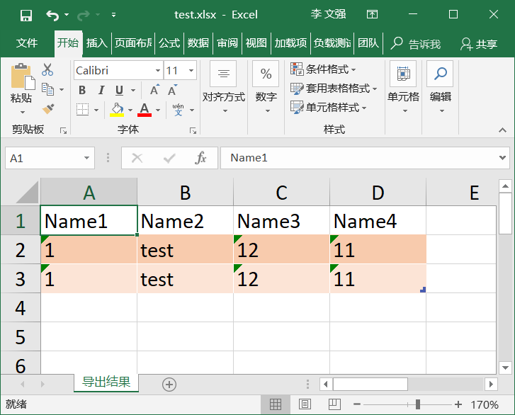

>

    public class ExportTestData
    {
        public string Name1 { get; set; }
        public string Name2 { get; set; }
        public string Name3 { get; set; }
        public string Name4 { get; set; }
    }
    
    var result = await Exporter.Export(filePath, new List<ExportTestData>()
    {
        new ExportTestData()
        {
            Name1 = "1",
            Name2 = "test",
            Name3 = "12",
            Name4 = "11",
        },
        new ExportTestData()
        {
            Name1 = "1",
            Name2 = "test",
            Name3 = "12",
            Name4 = "11",
        }
    });

---
#### Demo1-2

特性导出
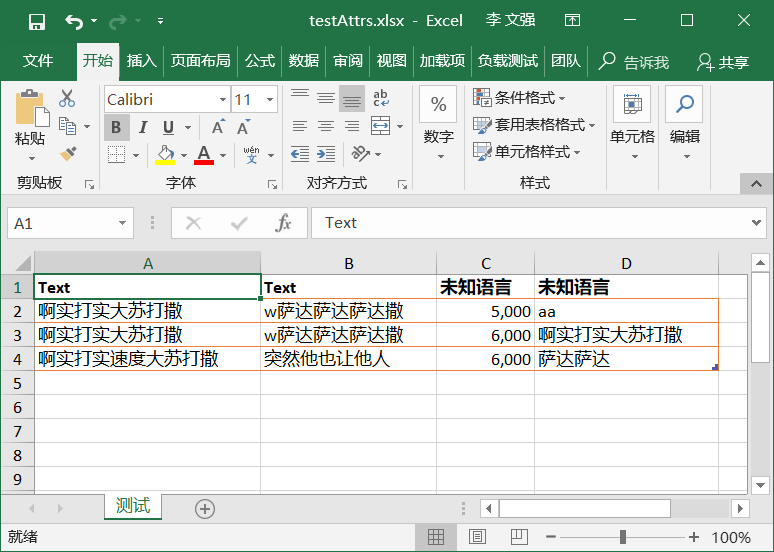

>

    [ExcelExporter(Name = "测试", TableStyle = "Light10")]
    public class ExportTestDataWithAttrs
    {
        [ExporterHeader(DisplayName = "加粗文本", IsBold = true)]
        public string Text { get; set; }
    
        [ExporterHeader(DisplayName = "普通文本")]
        public string Text2 { get; set; }
    
        [ExporterHeader(DisplayName = "忽略", IsIgnore = true)]
        public string Text3 { get; set; }
    
        [ExporterHeader(DisplayName = "数值", Format = "#,##0")]
        public double Number { get; set; }
    
        [ExporterHeader(DisplayName = "名称", IsAutoFit = true)]
        public string Name { get; set; }
    }
            var result = await Exporter.Export(filePath, new List<ExportTestDataWithAttrs>()
            {
                new ExportTestDataWithAttrs()
                {
                    Text = "啊实打实大苏打撒",
                    Name="aa",
                    Number =5000,
                    Text2 = "w萨达萨达萨达撒",
                    Text3 = "sadsad打发打发士大夫的"
                },
               new ExportTestDataWithAttrs()
                {
                    Text = "啊实打实大苏打撒",
                    Name="啊实打实大苏打撒",
                    Number =6000,
                    Text2 = "w萨达萨达萨达撒",
                    Text3 = "sadsad打发打发士大夫的"
                },
               new ExportTestDataWithAttrs()
                {
                    Text = "啊实打实速度大苏打撒",
                    Name="萨达萨达",
                    Number =6000,
                    Text2 = "突然他也让他人",
                    Text3 = "sadsad打发打发士大夫的"
                },
            });

#### Demo1-3

列头处理或者多语言支持
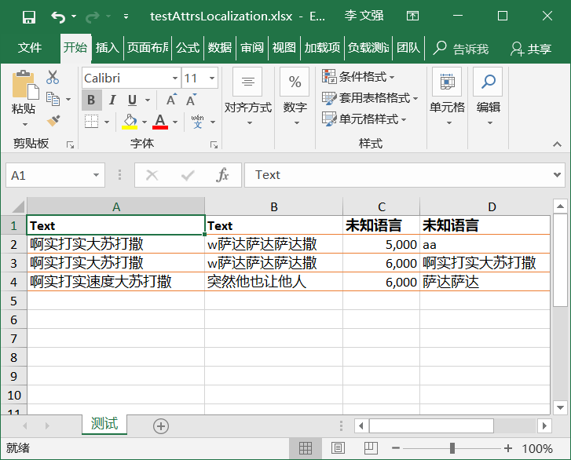

>

    [ExcelExporter(Name = "测试", TableStyle = "Light10")]
    public class AttrsLocalizationTestData
    {
        [ExporterHeader(DisplayName = "加粗文本", IsBold = true)]
        public string Text { get; set; }
    
        [ExporterHeader(DisplayName = "普通文本")]
        public string Text2 { get; set; }
    
        [ExporterHeader(DisplayName = "忽略", IsIgnore = true)]
        public string Text3 { get; set; }
    
        [ExporterHeader(DisplayName = "数值", Format = "#,##0")]
        public double Number { get; set; }
    
        [ExporterHeader(DisplayName = "名称", IsAutoFit = true)]
        public string Name { get; set; }
    }
            ExcelBuilder.Create().WithLocalStringFunc((key) =>
            {
                if (key.Contains("文本"))
                {
                    return "Text";
                }
                return "未知语言";
            }).Build();
    
            var filePath = Path.Combine(Directory.GetCurrentDirectory(), "testAttrsLocalization.xlsx");
            if (File.Exists(filePath)) File.Delete(filePath);
    
            var result = await Exporter.Export(filePath, new List<AttrsLocalizationTestData>()
            {
                new AttrsLocalizationTestData()
                {
                    Text = "啊实打实大苏打撒",
                    Name="aa",
                    Number =5000,
                    Text2 = "w萨达萨达萨达撒",
                    Text3 = "sadsad打发打发士大夫的"
                },
               new AttrsLocalizationTestData()
                {
                    Text = "啊实打实大苏打撒",
                    Name="啊实打实大苏打撒",
                    Number =6000,
                    Text2 = "w萨达萨达萨达撒",
                    Text3 = "sadsad打发打发士大夫的"
                },
               new AttrsLocalizationTestData()
                {
                    Text = "啊实打实速度大苏打撒",
                    Name="萨达萨达",
                    Number =6000,
                    Text2 = "突然他也让他人",
                    Text3 = "sadsad打发打发士大夫的"
                },
            });

### 导入 Demo

#### 导入特性（**ImporterAttribute**）：

- **HeaderRowIndex**：表头位置

#### 导入列头特性（**ImporterHeader**）：

+ **Name**：表头显示名称(不可为空)。
+ **Description**：表头添加注释。
+ **Author**：注释作者，默认值为“麦扣”。
+ **AutoTrim**：自动过滤空格，默认启用。
+ **FixAllSpace**：处理掉所有的空格，包括中间空格。默认false。
+ **ColumnIndex**：列索引，一般不建议设置。

#### 导入结果（ImportResult）：

+ **Data**：***IList\<T>***  导入的数据集合。
+ **RowErrors**：***IList<DataRowErrorInfo>*** 数据行错误。
+ **HasError**：***bool*** 是否存在导入错误。
+ **Exception**：异常信息
+ **TemplateErrors**：模板错误信息


---
#### Demo2-1 普通模板
##### 生成模板
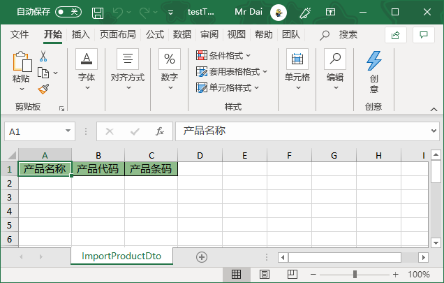

>
    public class ImportProductDto
    {
        /// <summary>
        /// 产品名称
        /// </summary>
        [ImporterHeader(Name = "产品名称")]
        public string Name { get; set; }
        /// <summary>
        /// 产品代码
        /// </summary>
        [ImporterHeader(Name = "产品代码")]
        public string Code { get; set; }
        /// <summary>
        /// 产品条码
        /// </summary>
        [ImporterHeader(Name = "产品条码")]
        public string BarCode { get; set; }
    }

##### 导入模板
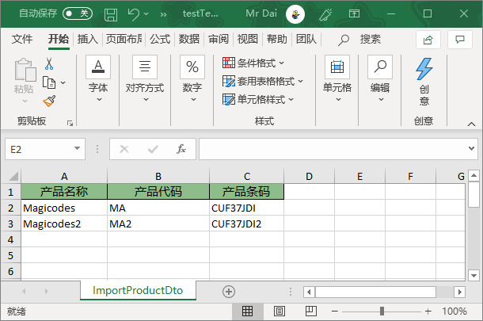
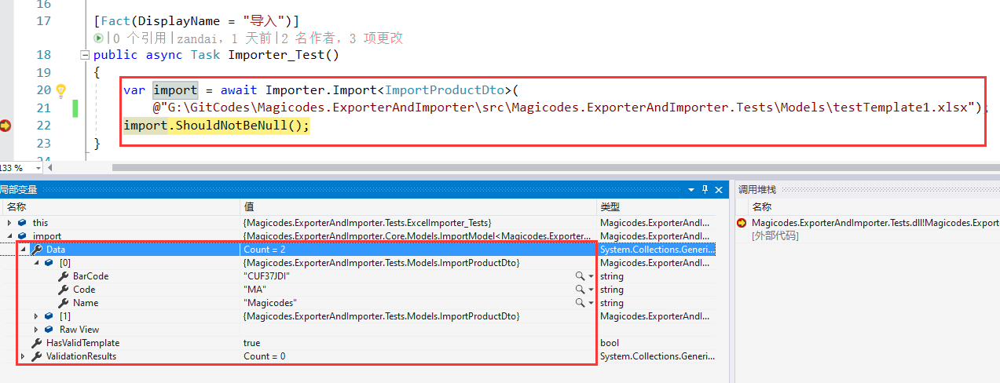

---
#### Demo2-2 多数据类型
##### 生成模板
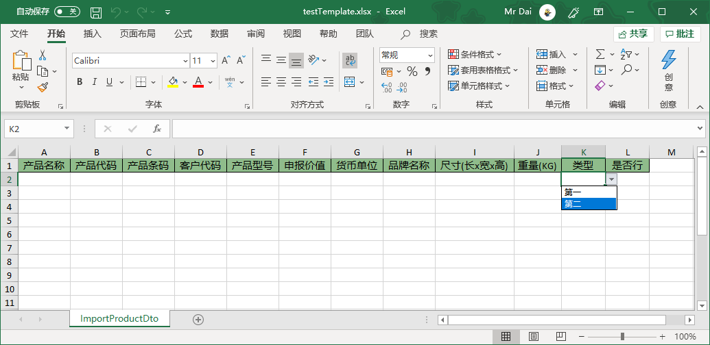
>
    public class ImportProductDto
    {
        /// <summary>
        /// 产品名称
        /// </summary>
        [ImporterHeader(Name = "产品名称")]
        public string Name { get; set; }
        /// <summary>
        /// 产品代码
        /// </summary>
        [ImporterHeader(Name = "产品代码")]
        public string Code { get; set; }
        /// <summary>
        /// 产品条码
        /// </summary>
        [ImporterHeader(Name = "产品条码")]
        public string BarCode { get; set; }
        /// <summary>
        /// 客户Id
        /// </summary>
        [ImporterHeader(Name = "客户代码")]
        public long ClientId { get; set; }
        /// <summary>
        /// 产品型号
        /// </summary>
        [ImporterHeader(Name = "产品型号")]
        public string Model { get; set; }
        /// <summary>
        /// 申报价值
        /// </summary>
        [ImporterHeader(Name = "申报价值")]
        public double DeclareValue { get; set; }
        /// <summary>
        /// 货币单位
        /// </summary>
        [ImporterHeader(Name = "货币单位")]
        public string CurrencyUnit { get; set; }
        /// <summary>
        /// 品牌名称
        /// </summary>
        [ImporterHeader(Name = "品牌名称")]
        public string BrandName { get; set; }
        /// <summary>
        /// 尺寸
        /// </summary>
        [ImporterHeader(Name = "尺寸(长x宽x高)")]
        public string Size { get; set; }
        /// <summary>
        /// 重量
        /// </summary>
        [ImporterHeader(Name = "重量(KG)")]
        public double Weight { get; set; }

        /// <summary>
        /// 类型
        /// </summary>
        [ImporterHeader(Name = "类型")]
        public ImporterProductType Type { get; set; }
    
        /// <summary>
        /// 是否行
        /// </summary>
        [ImporterHeader(Name = "是否行")]
        public bool IsOk { get; set; }
    }

>
    public enum ImporterProductType
    {
        [Display(Name = "第一")]
        One,
        [Display(Name = "第二")]
        Two
    }
##### 导入模板
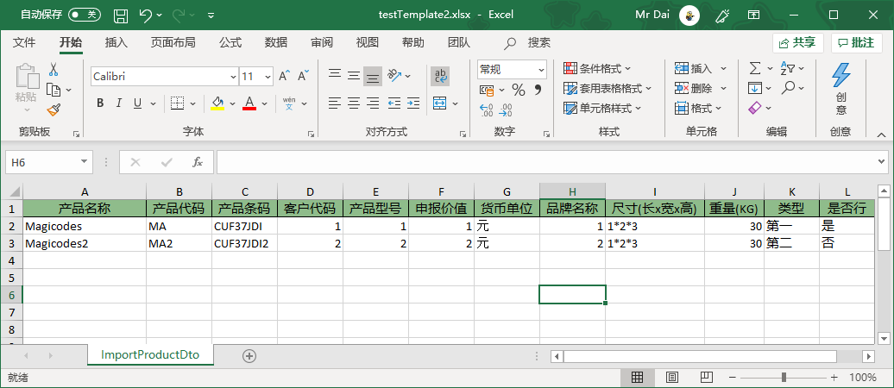
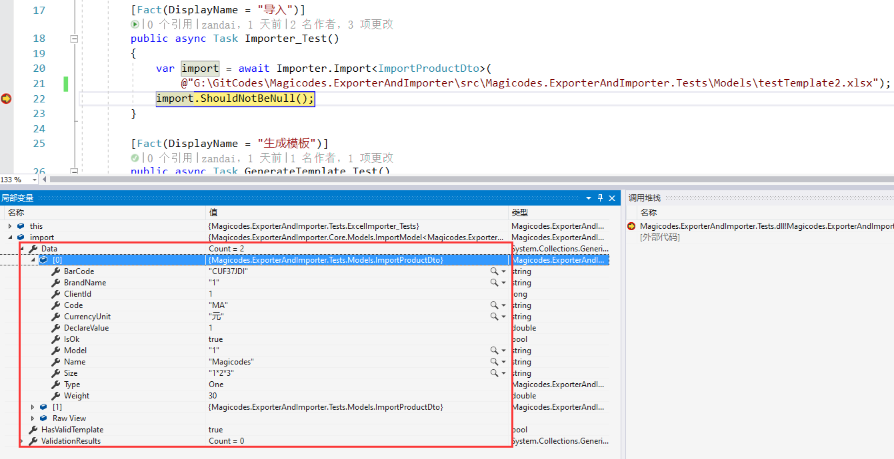

---
#### Demo2-3 数据验证
##### 生成模板
***必填项表头文本为红色***
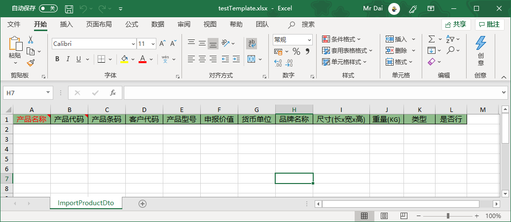

>
    public class ImportProductDto
    {
        /// <summary>
        /// 产品名称
        /// </summary>
        [ImporterHeader(Name = "产品名称",Description ="必填")]
        [Required(ErrorMessage = "产品名称是必填的")]
        public string Name { get; set; }
        /// <summary>
        /// 产品代码
        /// </summary>
        [ImporterHeader(Name = "产品代码", Description = "最大长度为8")]
        [MaxLength(8,ErrorMessage = "产品代码最大长度为8")]
        public string Code { get; set; }
        /// <summary>
        /// 产品条码
        /// </summary>
        [ImporterHeader(Name = "产品条码")]
        [MaxLength(10, ErrorMessage = "产品条码最大长度为10")]
        [RegularExpression(@"^\d*$", ErrorMessage = "产品条码只能是数字")]
        public string BarCode { get; set; }
        /// <summary>
        /// 客户Id
        /// </summary>
        [ImporterHeader(Name = "客户代码")]
        public long ClientId { get; set; }
        /// <summary>
        /// 产品型号
        /// </summary>
        [ImporterHeader(Name = "产品型号")]
        public string Model { get; set; }
        /// <summary>
        /// 申报价值
        /// </summary>
        [ImporterHeader(Name = "申报价值")]
        public double DeclareValue { get; set; }
        /// <summary>
        /// 货币单位
        /// </summary>
        [ImporterHeader(Name = "货币单位")]
        public string CurrencyUnit { get; set; }
        /// <summary>
        /// 品牌名称
        /// </summary>
        [ImporterHeader(Name = "品牌名称")]
        public string BrandName { get; set; }
        /// <summary>
        /// 尺寸
        /// </summary>
        [ImporterHeader(Name = "尺寸(长x宽x高)")]
        public string Size { get; set; }
        /// <summary>
        /// 重量
        /// </summary>
        [ImporterHeader(Name = "重量(KG)")]
        public double Weight { get; set; }

        /// <summary>
        /// 类型
        /// </summary>
        [ImporterHeader(Name = "类型")]
        public ImporterProductType Type { get; set; }
    
        /// <summary>
        /// 是否行
        /// </summary>
        [ImporterHeader(Name = "是否行")]
        public bool IsOk { get; set; }
    }

>
    public enum ImporterProductType
    {
        [Display(Name = "第一")]
        One,
        [Display(Name = "第二")]
        Two
    }
##### 导入模板
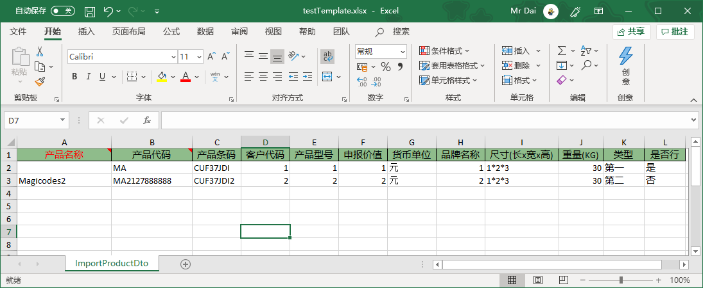
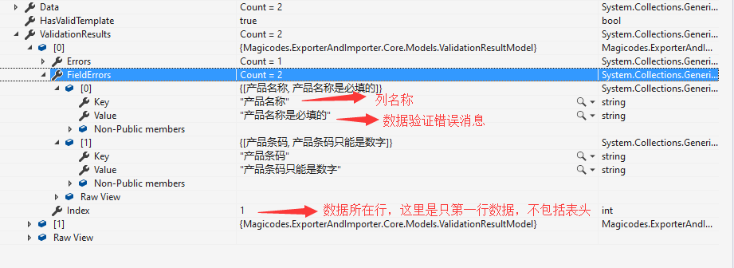

#### Docker中使用

- 如果是使用Excel导出，则需安装libgdiplus库

>
    # 安装libgdiplus库，用于Excel导出
    RUN apt-get update && apt-get install -y libgdiplus libc6-dev
    RUN ln -s /usr/lib/libgdiplus.so /usr/lib/gdiplus.dll

Dockerfile Demo
>
    FROM microsoft/dotnet:2.2-aspnetcore-runtime AS base
    # 安装libgdiplus库，用于Excel导出
    RUN apt-get update && apt-get install -y libgdiplus libc6-dev
    RUN ln -s /usr/lib/libgdiplus.so /usr/lib/gdiplus.dll
    WORKDIR /app
    EXPOSE 80

    FROM microsoft/dotnet:2.2-sdk AS build
    WORKDIR /src
    COPY ["src/web/Admin.Host/Admin.Host.csproj", "src/web/Admin.Host/"]
    COPY ["src/web/Admin.Web.Core/Admin.Web.Core.csproj", "src/web/Admin.Web.Core/"]
    COPY ["src/application/Admin.Application/Admin.Application.csproj", "src/application/Admin.Application/"]
    COPY ["src/core/Magicodes.Admin.Core/Magicodes.Admin.Core.csproj", "src/core/Magicodes.Admin.Core/"]
    COPY ["src/data/Magicodes.Admin.EntityFrameworkCore/Magicodes.Admin.EntityFrameworkCore.csproj", "src/data/Magicodes.Admin.EntityFrameworkCore/"]
    COPY ["src/core/Magicodes.Admin.Core.Custom/Magicodes.Admin.Core.Custom.csproj", "src/core/Magicodes.Admin.Core.Custom/"]
    COPY ["src/application/Admin.Application.Custom/Admin.Application.Custom.csproj", "src/application/Admin.Application.Custom/"]
    RUN dotnet restore "src/web/Admin.Host/Admin.Host.csproj"
    COPY . .
    WORKDIR "/src/src/web/Admin.Host"
    RUN dotnet build "Admin.Host.csproj" -c Release -o /app
    
    FROM build AS publish
    RUN dotnet publish "Admin.Host.csproj" -c Release -o /app
    
    FROM base AS final
    WORKDIR /app
    COPY --from=publish /app .
    ENTRYPOINT ["dotnet", "Magicodes.Admin.Web.Host.dll"]

- 如果是使用Pdf导出，则需安装相关字体，如：

>
	# 安装fontconfig库，用于Pdf导出
	RUN apt-get update && apt-get install -y fontconfig
	COPY /simsun.ttc /usr/share/fonts/simsun.ttc
