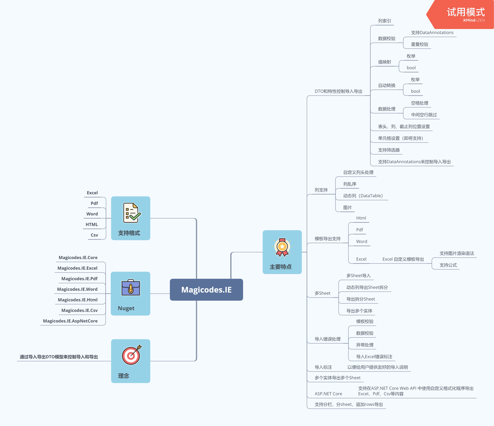

# Magicodes.IE | [English](README.md)
[](https://github.com/dotnetcore)
[](https://www.nuget.org/packages/Magicodes.IE.Core) 
[](https://dev.azure.com/xinlaiopencode/Magicodes.IE/_build/latest?definitionId=4&branchName=master)
[](https://www.nuget.org/stats/packages/Magicodes.IE.Core?groupby=Version)
[](https://github.com/dotnetcore/Magicodes.IE/blob/master/LICENSE)

[](https://starchart.cc/dotnetcore/Magicodes.IE)


[](https://opencollective.com/magicodes) 

## 目录

1. [概述](#概述)
2. [自动构建](#自动构建)
3. [Nuget包](#NuGet包)
4. [注意事项](#注意事项)
5. [教程](#教程)
6. [特点](#特点)
7. [FAQ](https://github.com/dotnetcore/Magicodes.IE/issues?q=label%3Aquestion)
8. [联系我们](#联系我们)
9. [更新历史](./RELEASE.md)
10. [友情赞助](#友情赞助)

## 概述

导入导出通用库，支持Dto导入导出、模板导出、花式导出以及动态导出，支持Excel、Csv、Word、Pdf和Html。

- Github：<https://github.com/dotnetcore/Magicodes.IE>
- 码云（手动同步，不维护）：<https://gitee.com/magicodes/Magicodes.IE>

****

## 功能清单

- [ ] Excel
  - [ ] 导入
    - [x] Dto导入
      - [x] 导入配置
        - [x] 指定Sheet名称(获取指定Sheet名称)，为空则自动获取第一个
        - [x] 指定Sheet下标
        - [x] 截止读取的列数（从1开始，如果已设置，则将支持空行以及特殊列）
        - [x] 是否标注错误（默认为true）
        - [x] Sheet顶部导入描述
        - [x] Sheet顶部导入描述高度(换行可能无法自动设定高度,默认为Excel的默认行高)
        - [x] 是否仅导出错误数据
        - [x] 表头位置
        - [x] 最大允许导入的行数（默认没有限制）
        - [x] 导入结果筛选器
        - [x] 导入列头筛选器
        - [x] 是否禁用所有筛选器
        - [x] 是否忽略列的大小写
      - [x] 列配置
        - [x] 列名
        - [x] 批注
        - [x] 作者
        - [x] 自动过滤空格，默认启用
        - [x] 处理所有的空格，包括中间空格
        - [x] 格式化（仅用于模板生成）
        - [x] 列索引，如果为0则自动计算
        - [x] 是否忽略
      - [x] 导入验证
        - [x] DataAnnotations（MaxLength、Required...）
        - [x] 是否允许重复
      - [x] 值映射
        - [x] bool
        - [x] 枚举
      - [x] 筛选器
        - [x] 结果筛选器
        - [x] 列头筛选器
      - [x] 特殊数据列导入
        - [x] 图片导入
          - [x] 导入为Base64
          - [x] 导入到临时目录
          - [x] 导入到指定目录
      - [x] 合并行导入
      - [x] 错误处理
        - [x] 模板校验错误
        - [x] 数据验证错误
        - [x] 异常
        - [x] 导入Excel文件的错误标注
      - [x] 生成导入模板
        - [x] 数据验证提示
        - [x] 必填项标注
        - [x] 数据下拉项生成（仅枚举）
        - [x] 生成批注
        - [x] Excel内置数据验证，并支持自定义提示（默认未开启）
          - [x] MaxLengthAttribute
          - [x] MinLengthAttribute
          - [x] StringLengthAttribute
          - [x] RangeAttribute
      - [x] 乱序导入（无需按列顺序导入）
      - [x] **多Sheet导入**
    - [ ] 动态导入（**Magicodes.IE.Stash**）
  - [ ] 导出

## 自动构建

- Build Status：[](https://dev.azure.com/xinlaiopencode/Magicodes.IE/_build/latest?definitionId=4&branchName=master)
- Azure DevOps coverage (master):  
- Azure DevOps tests (master):  

具体见：<https://dev.azure.com/xinlaiopencode/Magicodes.IE/_build?definitionId=4&_a=summary>

## NuGet包

#### 稳定版（推荐）

| **名称** |      **NuGet**      |
|----------|:-------------|
| **Magicodes.IE.Core** | **[](https://www.nuget.org/packages/Magicodes.IE.Core)** |
| **Magicodes.IE.Excel** | **[](https://www.nuget.org/packages/Magicodes.IE.Excel)**   |
| **Magicodes.IE.Excel.NPOI** | **[](https://www.nuget.org/packages/Magicodes.IE.Excel.NPOI)**   |
| **Magicodes.IE.Excel.AspNetCore** | **[](https://www.nuget.org/packages/Magicodes.IE.Excel.AspNetCore)**   |
| **Magicodes.IE.Pdf** | **[](https://www.nuget.org/packages/Magicodes.IE.Pdf)**   |
| **Magicodes.IE.Word** | **[](https://www.nuget.org/packages/Magicodes.IE.Word)**   |
| **Magicodes.IE.Html** | **[](https://www.nuget.org/packages/Magicodes.IE.Html)**   |
| **Magicodes.IE.Csv** | **[](https://www.nuget.org/packages/Magicodes.IE.Csv)**   |
| **Magicodes.IE.AspNetCore** | **[](https://www.nuget.org/packages/Magicodes.IE.AspNetCore)**   |
| **Magicodes.IE.EPPlus** | **[](https://www.nuget.org/packages/Magicodes.IE.EPPlus)**   |
| **Magicodes.IE.Excel.Abp** | **[](https://www.nuget.org/packages/Magicodes.IE.Excel.Abp)**   |
| **Magicodes.IE.Csv.Abp** | **[](https://www.nuget.org/packages/Magicodes.IE.Csv.Abp)**   |
| **Magicodes.IE.Html.Abp** | **[](https://www.nuget.org/packages/Magicodes.IE.Html.Abp)**   |
| **Magicodes.IE.Pdf.Abp** | **[](https://www.nuget.org/packages/Magicodes.IE.Pdf.Abp)**   |
| **Magicodes.IE.Word.Abp** | **[](https://www.nuget.org/packages/Magicodes.IE.Word.Abp)**   |
| **Magicodes.IE.Stash** | **[](https://www.nuget.org/packages/Magicodes.IE.Stash)**   |

## **注意事项**

- **Excel导入不支持“.xls”文件，即不支持Excel97-2003。**
- **如需在Docker中使用，请参阅文档中的《Docker中使用》一节。**
- **相关功能均已编写单元测试，在使用的过程中可以参考单元测试。**

## **教程**

1. **[基础教程之导入学生数据](docs/1.基础教程之导入学生数据.md "1.基础教程之导入学生数据")  （[点此访问国内文档](https://docs.xin-lai.com/2019/11/26/%E7%BB%84%E4%BB%B6/Magicodes.IE/1.%E5%9F%BA%E7%A1%80%E6%95%99%E7%A8%8B%E4%B9%8B%E5%AF%BC%E5%85%A5%E5%AD%A6%E7%94%9F%E6%95%B0%E6%8D%AE/)）**
2. **[基础教程之导出Excel](docs/2.基础教程之导出Excel.md "2.基础教程之导出Excel")  [（点此访问国内文档）](https://docs.xin-lai.com/2020/02/19/%E7%BB%84%E4%BB%B6/Magicodes.IE/2.Magicodes.IE%E5%9F%BA%E7%A1%80%E6%95%99%E7%A8%8B%E4%B9%8B%E5%AF%BC%E5%87%BAExcel/)**
3. **[基础教程之导出Pdf收据](docs/3.基础教程之导出Pdf收据.md "3.基础教程之导出Pdf收据")** [**(点此访问国内文档)**](https://docs.xin-lai.com/2020/02/25/%E7%BB%84%E4%BB%B6/Magicodes.IE/3.Magicodes.IE%E5%9F%BA%E7%A1%80%E6%95%99%E7%A8%8B%E4%B9%8B%E5%AF%BC%E5%87%BAPdf/)
4. **[在Docker中使用](docs/4.在Docker中使用.md "4.在Docker中使用")**
5. **[动态导出](docs/5.动态导出.md "5.动态导出")**
6. **[多Sheet导入](docs/6.多Sheet导入.md "6.多Sheet导入")**
7. **[Csv导入导出](docs/7.Csv导入导出.md "7.Csv导入导出")**
8. **[Excel图片导入导出](docs/8.Excel图片导入导出.md "8.Excel图片导入导出")** [**(点此访问国内文档)**](https://docs.xin-lai.com/2020/03/16/%E7%BB%84%E4%BB%B6/Magicodes.IE/%E4%BD%BF%E7%94%A8Magicodes.IE.Excel%E5%AE%8C%E6%88%90Excel%E5%9B%BE%E7%89%87%E7%9A%84%E5%AF%BC%E5%85%A5%E5%92%8C%E5%AF%BC%E5%87%BA/)
9. **[Excel模板导出之导出教材订购表](docs/9.Excel模板导出之导出教材订购表.md "9.Excel模板导出之导出教材订购表")（[点此访问国内文档](https://docs.xin-lai.com/2020/01/08/%E7%BB%84%E4%BB%B6/Magicodes.IE/7.Excel%E6%A8%A1%E6%9D%BF%E5%AF%BC%E5%87%BA%E4%B9%8B%E5%AF%BC%E5%87%BA%E6%95%99%E6%9D%90%E8%AE%A2%E8%B4%AD%E8%A1%A8/)）**
10. **[进阶篇之导入导出筛选器](https://docs.xin-lai.com/2020/09/21/%E7%BB%84%E4%BB%B6/Magicodes.IE/Magicodes.IE%E4%B9%8B%E5%AF%BC%E5%85%A5%E5%AF%BC%E5%87%BA%E7%AD%9B%E9%80%89%E5%99%A8/)**
11. **[Magicodes.IE之花式导出](https://docs.xin-lai.com/2020/09/28/%E7%BB%84%E4%BB%B6/Magicodes.IE/Magicodes.IE%E4%B9%8B%E8%8A%B1%E5%BC%8F%E5%AF%BC%E5%87%BA/)**
12. **[Magicodes.IE.AspNetCore之一行代码多格式导出](docs/12.Magicodes.IE.AspNetCore之一行代码多格式导出.md)**
13. **[性能测试](docs/13.性能测试.md)**
14. [**Excel合并行导入**](docs/Excel合并行导入.md)
15. [**Excel模板导出之动态导出**](docs/Excel模板导出之动态导出.md)
16. **[Magicodes.IE.Excel.AspNetCore之快速导出Excel（new）](docs/AspNetCore之快速导出Excel.md)**

**其他教程见下文或单元测试**

## 特点

- **需配合相关导入导出的DTO模型使用，支持通过DTO以及相关特性控制导入导出。配置特性即可控制相关逻辑和显示结果，无需修改逻辑代码；**
****
- **支持各种筛选器，支持依赖注入，以便支持多语言、动态控制列展示等场景，具体使用见单元测试：**
  - **导入列头筛选器【IImportHeaderFilter】（可动态指定导入列、导入的值映射关系）**
  - **导出列头筛选器【IImportHeaderFilter】（可动态控制导出列，支持动态导出（DataTable））**
  - **导出列头集合筛选器【IImportHeadersFilter】（可动态控制导出列，支持动态导出（DataTable））**
  - **导入结果筛选器【IImportResultFilter】（可修改标注文件）**
- **导出支持文本自定义过滤或处理；**
- **导入支持中间空行自动跳过；**
- **导入支持自动根据 DTO 生成导入模板,针对必填项将自动标注；**
****
- **导入支持数据下拉选择，目前仅支持枚举类型；**
- **导入数据支持前后空格以及中间空格处理，允许指定列进行设置；**
- **导入支持模板自动检查，数据自动校验，异常统一处理，并提供统一的错误封装，包含异常、模板错误和行数据错误；**
****
- **支持导入表头位置设置，默认为1；**
- **支持导入列乱序，无需按顺序一一对应；**
- **支持导入指定列索引，默认自动识别；**
- **导出Excel支持拆分Sheet，仅需设置特性【ExporterAttribute】的【MaxRowNumberOnASheet】的值，为0则不拆分。具体见单元测试；**
- **支持将导入Excel进行错误标注；**
****
****
- **导入支持截止列设置，如未设置则默认遇到空格截止；**
- **支持导出HTML、Word、Pdf，支持自定义导出模板；**
  - **导出HTML**
  ****
  - **导出Word**
  ****
  - **导出Pdf，支持设置，具体见更新日志**
  ****
  - **导出收据**
  ****
- **导入支持重复验证；**
****
- **支持单个数据模板导出，常用于导出收据、凭据等业务**
- **支持动态列导出（基于DataTable），并且超过100W将自动拆分Sheet。（感谢张善友老师（[https://github.com/xin-lai/Magicodes.IE/pull/8](https://github.com/xin-lai/Magicodes.IE/pull/8 ) ））**
- **支持 dynamic/ExpandoObject 动态列导出**
```csharp
        [Fact(DisplayName = "DTO导出支持动态类型")]
        public async Task ExportAsByteArraySupportDynamicType_Test()
        {
            IExporter exporter = new ExcelExporter();

            var filePath = GetTestFilePath($"{nameof(ExportAsByteArraySupportDynamicType_Test)}.xlsx");

            DeleteFile(filePath);

            var source = GenFu.GenFu.ListOf<ExportTestDataWithAttrs>();
            string fields = "text,number,name";
            var shapedData = source.ShapeData(fields) as ICollection<ExpandoObject>;

            var result = await exporter.ExportAsByteArray<ExpandoObject>(shapedData);
            result.ShouldNotBeNull();
            result.Length.ShouldBeGreaterThan(0);
            File.WriteAllBytes(filePath, result);
            File.Exists(filePath).ShouldBeTrue();
        }
```
- **支持值映射，支持通过“ValueMappingAttribute”特性设置值映射关系，目前仅可用于枚举和Bool类型，支持导入导出。**
```csharp
        /// <summary>
        ///     性别
        /// </summary>
        [ImporterHeader(Name = "性别")]
        [Required(ErrorMessage = "性别不能为空")]
        [ValueMapping(text: "男", 0)]
        [ValueMapping(text: "女", 1)]
        public Genders Gender { get; set; }
```

- **也可以继承“ValueMappingsBaseAttribute”特性基类实现值映射关系，目前仅可用于枚举和Bool类型，支持导入导出。**
```csharp
        [AttributeUsage(AttributeTargets.Property, AllowMultiple = true)]
        public class GenderLocalAttribute : ValueMappingsBaseAttribute
        {
            public override Dictionary<string, object> GetMappings(PropertyInfo propertyInfo)
            {
                var res= new Dictionary<string, object>();
                res.Add("男",0);
                res.Add("女",1);
                return res;
            }
        }


        /// <summary>
        ///     性别
        /// </summary>
        [ImporterHeader(Name = "性别")]
        [Required(ErrorMessage = "性别不能为空")]
        [GenderLocal]
        public Genders Gender { get; set; }
```


- **支持枚举和Bool类型的导入数据验证项的生成，以及相关数据转换**
	- **枚举默认情况下会自动获取枚举的描述、显示名、名称和值生成数据项**

		```csharp
			/// <summary>
			/// 学生状态 正常、流失、休学、勤工俭学、顶岗实习、毕业、参军
			/// </summary>
			public enum StudentStatus
			{
				/// <summary>
				/// 正常
				/// </summary>
				[Display(Name = "正常")]
				Normal = 0,

				/// <summary>
				/// 流失
				/// </summary>
				[Description("流水")]
				PupilsAway = 1,

				/// <summary>
				/// 休学
				/// </summary>
				[Display(Name = "休学")]
				Suspension = 2,

				/// <summary>
				/// 勤工俭学
				/// </summary>
				[Display(Name = "勤工俭学")]
				WorkStudy = 3,

				/// <summary>
				/// 顶岗实习
				/// </summary>
				[Display(Name = "顶岗实习")]
				PostPractice = 4,

				/// <summary>
				/// 毕业
				/// </summary>
				[Display(Name = "毕业")]
				Graduation = 5,

				/// <summary>
				/// 参军
				/// </summary>
				[Display(Name = "参军")]
				JoinTheArmy = 6,
			}
		```

		****

	- **bool类型默认会生成“是”和“否”的数据项**
	- **如果已设置自定义值映射，则不会生成默认选项**

- **支持excel多Sheet导入；**
  ****

- **支持Excel模板导出，JSON动态导出，并且支持图片渲染**
  ****

  渲染语法如下所示：

  ```
    {{Company}}  //单元格渲染
    {{Table>>BookInfos|RowNo}} //表格渲染开始语法
    {{Remark|>>Table}}//表格渲染结束语法
    {{Image::ImageUrl?Width=50&Height=120&Alt=404}} //图片渲染
    {{Image::ImageUrl?w=50&h=120&Alt=404}} //图片渲染
    {{Image::ImageUrl?Alt=404}} //图片渲染
    {{Formula::AVERAGE?params=G4:G6}}  //公式渲染
    {{Formula::SUM?params=G4:G6&G4}}   //公式渲染
  ```

  后续将支持自定义管道。

- **支持Excel导入模板生成标注**
  

- **支持Excel图片导入导出**
  - 图片导入
    - 导入为Base64
    - 导入到临时目录
    - 导入到指定目录
  - 图片导出
    - 将文件路径导出为图片
    - 将网络路径导出为图片

- **支持多个实体导出多个Sheet**

- **支持使用System.ComponentModel.DataAnnotations命名空间下的部分特性来控制导入导出**  [#63](https://github.com/dotnetcore/Magicodes.IE/issues/63)

- **支持在ASP.NET Core Web API 中使用自定义格式化程序导出Excel、Pdf、Csv等内容，具体见教程** [#64](https://github.com/dotnetcore/Magicodes.IE/issues/64)

- **支持分栏、分sheet、追加rows导出**

```csharp
exporter.Append(list1).SeparateByColumn().Append(list2).ExportAppendData(filePath);
```
具体见上面教程《Magicodes.IE之花式导出》

- **支持单元格导出宽度设置**
```csharp
[ExporterHeader(Width = 100)]
public DateTime Time3 { get; set; }
```

- **Excel导出支持HeaderRowIndex，在ExcelExporterAttribute导出特性类中添加HeaderRowIndex属性，方便导出时去指定从第一行开始导出。**

- **Excel生成导入模板支持内置数据验证**

对于内置数据验证的支持可通过IsInterValidation属性开启，并且需要注意的是仅支持MaxLengthAttribute、 MinLengthAttribute、 StringLengthAttribute、 RangeAttribute支持对内置数据验证的开启操作。 


支持对输入提示的展示操作：


- **Excel导入支持合并行数据** [#239](https://github.com/dotnetcore/Magicodes.IE/issues/239)

  

- 添加对Abp模块的包装，具体见[#318](https://github.com/dotnetcore/Magicodes.IE/issues/318)。

## **联系我们**

> ##### **订阅号**

**关注“麦扣聊技术”订阅号可以获得最新文章、教程、文档，并且加入微信生态群：**

<table>
<tr>
<td>

</td>
<td>

</td>
</tr>
</table>

> ##### **QQ群**

- **编程交流群<85318032>**（由于不经常在线，为了避免骚扰，设置了一定门槛）

> ##### **文档官网&官方博客**

- **文档官网：<https://docs.xin-lai.com/>**
- **博客：<http://www.cnblogs.com/codelove/>**


> ##### **其他开源库**

- **<https://github.com/xin-lai>**
- **<https://gitee.com/magicodes>**

### Code Contributors

<a href="https://github.com/dotnetcore/Magicodes.IE/graphs/contributors"></a>

### Financial Contributors

Become a financial contributor and help us sustain our community. [[Contribute](https://opencollective.com/magicodes/contribute)]

#### Individuals

<a href="https://opencollective.com/magicodes"></a>

#### Organizations

Support this project with your organization. Your logo will show up here with a link to your website. [[Contribute](https://opencollective.com/magicodes/contribute)]

<a href="https://opencollective.com/magicodes/organization/0/website"></a>
<a href="https://opencollective.com/magicodes/organization/1/website"></a>
<a href="https://opencollective.com/magicodes/organization/2/website"></a>
<a href="https://opencollective.com/magicodes/organization/3/website"></a>
<a href="https://opencollective.com/magicodes/organization/4/website"></a>
<a href="https://opencollective.com/magicodes/organization/5/website"></a>
<a href="https://opencollective.com/magicodes/organization/6/website"></a>
<a href="https://opencollective.com/magicodes/organization/7/website"></a>
<a href="https://opencollective.com/magicodes/organization/8/website"></a>
<a href="https://opencollective.com/magicodes/organization/9/website"></a>
