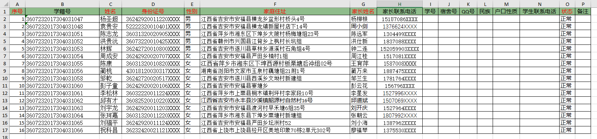
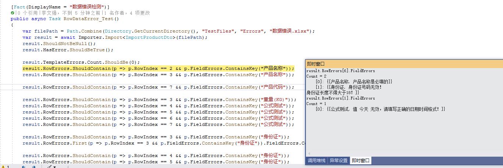
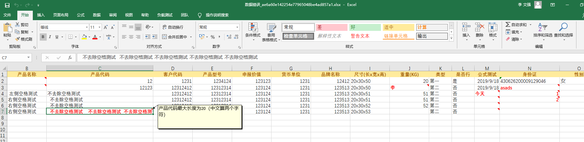
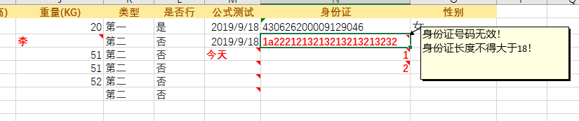

# Basic tutorial of importing student data

## Description

This tutorial explains how to use Magicodes.IE.Excel to complete the Excel import of student data.

## Main points

- Uses Magicodes.IE.Excel to complete the Excel data import
- Creating a Dto for import data.
- Magicodes.IE.Excel  can automatically generate imported Excel templates, data validation (including duplicate validation), template validation, read settings, value constraints and mapping, and output Excel validation markup based on Dto and feature settings.

## Main steps

### 1.Installation package - Magicodes.IE.Excel

In this tutorial, we will only demonstrate the use of Excel to complete the import of student data. We need to install the following packages in the prepared project with the following reference commands：

```powershell
Install-Package Magicodes.IE.Excel
```


### 2.Create Import Dto

The main code is shown below:

- Student Data Dto

  ```c#
      /// <summary>
      /// Importing Student Data Dto
      /// IsLabelingError：Whether to mark data errors
      /// </summary>
      [ExcelImporter(IsLabelingError = true)]
      public class ImportStudentDto
      {
          /// <summary>
          ///     Serial No.
          /// </summary>
          [ImporterHeader(Name = "Serial No.")]
          public long SerialNumber { get; set; }
  
          /// <summary>
          ///     Student Registration No.
          /// </summary>
          [ImporterHeader(Name = "Student Registration No.")]
          [MaxLength(30, ErrorMessage = "The number of words exceeds the maximum limit, please modify!")]
          public string StudentCode { get; set; }
  
          /// <summary>
          ///     Name
          /// </summary>
          [ImporterHeader(Name = "Name")]
          [Required(ErrorMessage = "Name cannot be empty")]
          [MaxLength(50, ErrorMessage = "The number of words exceeds the maximum limit, please modify!")]
          public string Name { get; set; }
  
          /// <summary>
          ///     ID number
          /// </summary>
          [ImporterHeader(Name = "ID number", IsAllowRepeat = false)]
          [Required(ErrorMessage = "ID number cannot be empty")]
          [MaxLength(18, ErrorMessage = "The number of words exceeds the maximum limit, please modify!")]
          public string IdCard { get; set; }
  
          /// <summary>
          ///     Gender
          /// </summary>
          [ImporterHeader(Name = "Gender")]
          [Required(ErrorMessage = "Gender  cannot be empty")]
          [ValueMapping("Male", 0)]
          [ValueMapping("Female", 1)]
          public Genders Gender { get; set; }
  
          /// <summary>
          ///     Home Address
          /// </summary>
          [ImporterHeader(Name = "Home Address")]
          [Required(ErrorMessage = "Home Address cannot be empty")]
          [MaxLength(200, ErrorMessage = "The number of words exceeds the maximum limit, please modify!")]
          public string Address { get; set; }
  
          /// <summary>
          ///     Parent's name
          /// </summary>
          [ImporterHeader(Name = "Parent's name")]
          [Required(ErrorMessage = "Parent's name cannot be empty")]
          [MaxLength(50, ErrorMessage = "The number of words exceeds the maximum limit, please modify!")]
          public string Guardian { get; set; }
  
          /// <summary>
          ///     Parental contact number
          /// </summary>
          [ImporterHeader(Name = "Parental contact number")]
          [MaxLength(20, ErrorMessage = "The number of words exceeds the maximum limit, please modify!")]
          public string GuardianPhone { get; set; }
  
          /// <summary>
          ///     Student ID
          /// </summary>
          [ImporterHeader(Name = "Student ID")]
          [MaxLength(30, ErrorMessage = "The number of words exceeds the maximum limit, please modify!")]
          public string StudentNub { get; set; }
  
          /// <summary>
          ///     Dormitory number
          /// </summary>
          [ImporterHeader(Name = "Dormitory number")]
          [MaxLength(20, ErrorMessage = "The number of words exceeds the maximum limit, please modify!")]
          public string DormitoryNo { get; set; }
  
          /// <summary>
          ///     QQ
          /// </summary>
          [ImporterHeader(Name = "QQ number")]
          [MaxLength(30, ErrorMessage = "The number of words exceeds the maximum limit, please modify!")]
          public string QQ { get; set; }
  
          /// <summary>
          ///     Ethnic
          /// </summary>
          [ImporterHeader(Name = "Ethnic")]
          [MaxLength(2, ErrorMessage = "The number of words exceeds the maximum limit, please modify!")]
          public string Nation { get; set; }
  
          /// <summary>
          ///     Household
          /// </summary>
          [ImporterHeader(Name = "Household")]
          [MaxLength(10, ErrorMessage = "The number of words exceeds the maximum limit, please modify!")]
          public string HouseholdType { get; set; }
  
          /// <summary>
          ///     Contact number
          /// </summary>
          [ImporterHeader(Name = "Contact number")]
          [MaxLength(20, ErrorMessage = "The number of words exceeds the maximum limit, please modify!")]
          public string Phone { get; set; }
  
          /// <summary>
          ///     Status
          ///     Test for nullable enumeration types
          /// </summary>
          [ImporterHeader(Name = "Status")]
          public StudentStatus? Status { get; set; }
  
          /// <summary>
          ///     Remarks
          /// </summary>
          [ImporterHeader(Name = "Remarks")]
          [MaxLength(200, ErrorMessage = "The number of words exceeds the maximum limit, please modify!")]
          public string Remark { get; set; }
  
          /// <summary>
          ///     Whether live on campus (dormitory)
          /// </summary>
          [ImporterHeader(IsIgnore = true)]
          public bool? IsBoarding { get; set; }
  
          /// <summary>
          ///     Class id
          /// </summary>
          [ImporterHeader(IsIgnore = true)]
          public Guid ClassId { get; set; }
  
          /// <summary>
          ///     School Id
          /// </summary>
          [ImporterHeader(IsIgnore = true)]
          public Guid? SchoolId { get; set; }
  
          /// <summary>
          ///     Campus Id
          /// </summary>
          [ImporterHeader(IsIgnore = true)]
          public Guid? CampusId { get; set; }
  
          /// <summary>
          ///     MajorsId
          /// </summary>
          [ImporterHeader(IsIgnore = true)]
          public Guid? MajorsId { get; set; }
  
          /// <summary>
          ///     GradeId
          /// </summary>
          [ImporterHeader(IsIgnore = true)]
          public Guid? GradeId { get; set; }
      }
  ```
  As shown in the above code, we defined the above student data Dto with the following main considerations ：

  1. ExcelImporterfeature allows you to set some global settings for importing, such as whether to mark errors, the name of the imported Sheet (if not set, the first one is automatically obtained), the number of columns to be read, and the position of the sheet header.
  2. Support common data validation settings, such as required and maximum length.
  3. Support data duplicate verification, such as ID numbers. Refer ImporterHeader features of IsAllowRepeat setting.
  4. Supports column header settings，For example ImporterHeader - Name Properties。Other than that，ImporterHeader also supports automatic space filtering (enabled by default), disposing off all spaces, column indexing, etc.。
  5. Ignore setting is enabled for data columns，For example SchoolId "[ImporterHeader(IsIgnore = true)]"。
  6. Value mapping is used， For example  “Gender” attribute. When value mapping is enabled, the value mapping will not be retrieved from the enumeration definition。
  7. Enumeration support, support for enumeration from the Display、Description Get value mapping。See below for enumeration definitions。

- Gender Enumeration

  The definition is as follows：

  ```c#
  /// <summary>
  ///     Gender
  /// </summary>
  public enum Genders
  {
      /// <summary>
      ///     男
      /// </summary>
      Man = 0,
  
      /// <summary>
      ///     女
      /// </summary>
      Female = 1
  }
  ```
  Note point 7 above.

- Student Status Enumeration

  ```c#
  /// <summary>
  ///    Student Status: Normal, Attrition, Suspended, Work-Study, Internship, Graduation, Military
  /// </summary>
  public enum StudentStatus
  {
      /// <summary>
      ///     Normal
      /// </summary>
      [Display(Name = "Normal")] Normal = 0,
  
      /// <summary>
      ///     Attrition
      /// </summary>
      [Description("Attrition")] PupilsAway = 1,
  
      /// <summary>
      ///     Suspended
      /// </summary>
      [Display(Name = "Suspended")] Suspension = 2,
  
      /// <summary>
      ///     Work-Study
      /// </summary>
      [Display(Name = "Work-Study")] WorkStudy = 3,
  
      /// <summary>
      ///     Internship
      /// </summary>
      [Display(Name = "Internship")] PostPractice = 4,
  
      /// <summary>
      ///     Graduation
      /// </summary>
      [Display(Name = "Graduation")] Graduation = 5,
  
      /// <summary>
      ///     Military
      /// </summary>
      [Display(Name = "Military")] JoinTheArmy = 6
  }
  ```
  Note point 7 above


### 3.Generate import templates and populate them with data

Do you have to prepare a template before importing? handwritten template？Not required! Magicodes.IE.Excel Provided the basis for DTO Automatic generation Excel Methods of importing templates，We can call it directly. Here we look at the relevant methods for importing：

```c#
/// <summary>
///     Import
/// </summary>
public interface IImporter
{
    /// <summary>
    ///     生成Excel导入模板
    /// </summary>
    /// <typeparam name="T"></typeparam>
    /// <returns></returns>
    Task<TemplateFileInfo> GenerateTemplate<T>(string fileName) where T : class, new();

    /// <summary>
    ///     生成Excel导入模板
    /// </summary>
    /// <typeparam name="T"></typeparam>
    /// <returns>二进制字节</returns>
    Task<byte[]> GenerateTemplateBytes<T>() where T : class, new();

    /// <summary>
    ///     导入模型验证数据
    /// </summary>
    /// <typeparam name="T"></typeparam>
    /// <param name="filePath"></param>
    /// <returns></returns>
    Task<ImportResult<T>> Import<T>(string filePath) where T : class, new();
}
```

By using GenerateTemplate in the above method, we can get the required import template. The specific use can be found in the following unit tests.

```c#
    public IImporter Importer = new ExcelImporter();

    [Fact(DisplayName = "生成学生数据导入模板（测试枚举生成模板）")]
    public async Task GenerateStudentImportTemplate_Test()
    {
        var filePath = Path.Combine(Directory.GetCurrentDirectory(),
            nameof(GenerateStudentImportTemplate_Test) + ".xlsx");
        if (File.Exists(filePath)) File.Delete(filePath);

        var result = await Importer.GenerateTemplate<ImportStudentDto>(filePath);
        result.ShouldNotBeNull();
        File.Exists(filePath).ShouldBeTrue();

        //TODO:读取Excel检查表头和格式
    }
```

The above DTO gets the template and populates the data as shown below:



**Note: The enumeration will automatically generate a drop-down selection, and the required column headers will be marked in red**

### 4. Get student import verification errors and data

After populating the data according to the template, we are ready to perform the data import. Typically, we have the following steps.

1. Validate imported data

   Importing data through Magicodes.IE.Excel will automatically perform validation and output the validation results for frontend display. Specifically, we can look through its imported result classes to see.

   ```c#
   /// <summary>
   ///     Import Results
   /// </summary>
   public class ImportResult<T> where T : class
   {
       /// <summary>
       /// </summary>
       public ImportResult()
       {
           RowErrors = new List<DataRowErrorInfo>();
       }
   
       /// <summary>
       ///     Importing Data
       /// </summary>
       public virtual ICollection<T> Data { get; set; }
   
       /// <summary>
       ///     Validation error
       /// </summary>
       public virtual IList<DataRowErrorInfo> RowErrors { get; set; }
   
       /// <summary>
       ///     Template error
       /// </summary>
       public virtual IList<TemplateErrorInfo> TemplateErrors { get; set; }
   
       /// <summary>
       ///     Import exception information
       /// </summary>
       public virtual Exception Exception { get; set; }
   
       /// <summary>
       ///    Is there an import error
       /// </summary>
       public virtual bool HasError => Exception != null ||
                                       (TemplateErrors?.Count(p => p.ErrorLevel == ErrorLevels.Error) ?? 0) > 0 ||
                                       (RowErrors?.Count ?? 0) > 0;
   }
   ```
   Among them:

   - Data is the data result

   - RowErrors is  validation errors, such as required, duplicate validation, text length, etc. will give the line number, field and the set of field errors

    

   - TemplateErrors is template errors, such as missing mandatory columns and other error messages. Support error level (warning, error)

   - Exception is  import exception information

   - HasError is  existence of errors (without warnings)

   Through ImportResult, we can easily get the import validation error without writing additional code. Usually, we need to determine the HasError property during import and return a specific error result to the frontend.

   The data import reference code is shown below：

   ```c#
       [Fact(DisplayName = "Student base data import")]
       public async Task StudentInfoImporter_Test()
       {
           var filePath = Path.Combine(Directory.GetCurrentDirectory(), "TestFiles", "Import", "学生基础数据导入.xlsx");
           var import = await Importer.Import<ImportStudentDto>(filePath);
           import.ShouldNotBeNull();
           if (import.Exception != null) _testOutputHelper.WriteLine(import.Exception.ToString());
   
           if (import.RowErrors.Count > 0) _testOutputHelper.WriteLine(JsonConvert.SerializeObject(import.RowErrors));
           import.HasError.ShouldBeFalse();
           import.Data.ShouldNotBeNull();
           import.Data.Count.ShouldBe(16);
       }
   ```

2. Get verification markup

   The customer said although you hinted, but I still do not know what is wrong! What to do?!!!

   

   We have thoughtfully prepared for you the markup of the Excel file for importing data:

	
	

    How to open this [Epic Plot]? Simply by one step:
   

   ```c#
   [ExcelImporter(IsLabelingError = true)]
   ```

   Once turned on, we will automatically save the markup file "{target file name}_.xlsx" to the target location.

3. Get imported data

   No more errors? That is, HasError is false, then we can just get the Data and do whatever we want!


## Finally
 
This concludes the entire tutorial on importing student data. ** Related libraries will be updated all the time, and there may be slight differences in functional experience with this tutorial, please refer to the relevant specific code, version logs, and unit test examples. **