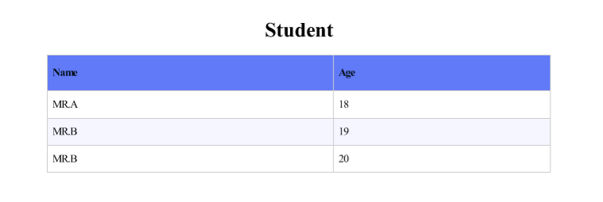
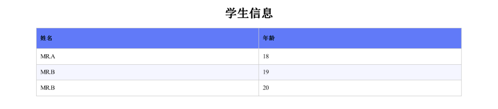
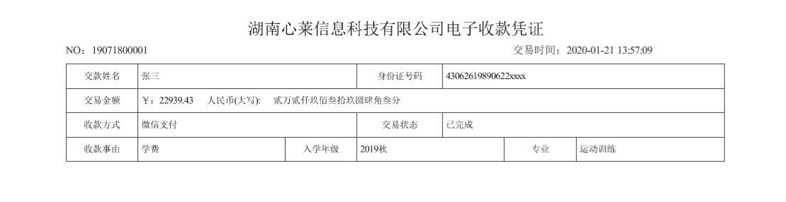
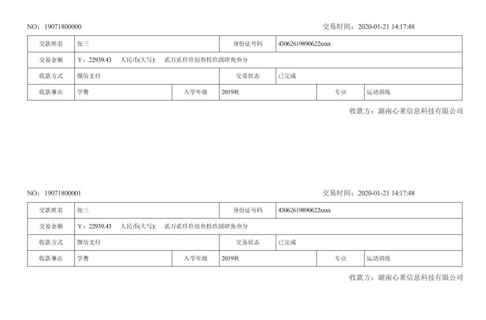

# Basic tutorial of export Pdf receipts

## Description

This tutorial mainly explains how to use Magicodes.

## Main points

- Export PDF data
- Customize PDF templates
- Export documents
- How to export documents in bulk

## Export feature description

### PdfExporterAttribute
PdfExporterAttribute feature used to set the overall settings for Pdf export, such as direction, paper, etc.. Mainly contains the following settings.

+ **Name**:Document Title
+ **FontSize**:Font Size
+ **Orientation**： Orientation (horizontal or vertical)
+ **PaperKind**： Paper type (default A4)
+ **IsWriteHtml**： Whether to output HTML templates
+ **IsEnablePagesCount**：Whether paging is enabled
+ **Encoding**：Encoding, default utf-8
+ **HeaderSettings**：Export header settings
+ **FooterSettings**：Export bottom setting

### ExporterHeaderAttribute

ExporterHeaderAttribute feature used to set the column header information, in the Pdf form, can be used to set the display name.
**DisplayName**： Display Name

## Steps to use

### 1.Installation package Magicodes.IE.Pdf

```powershell
Install-Package Magicodes.IE.Pdf
```

### 2.Exporting PDF data

- Create Dto class

```csharp
        public class Student
        {
            /// <summary>
            ///     姓名
            /// </summary>
            public string Name { get; set; }
            /// <summary>
            ///     年龄
            /// </summary>
            public int Age { get; set; }
        }
```

```csharp
       public async Task ExportPdf()
        {
            var exporter = new PdfExporter();
            var result = await exporter.ExportListByTemplate("test.pdf", new List<Student>()
            {
                new Student
                {
                    Name = "MR.A",
                    Age = 18
                },
                new Student
                {
                    Name = "MR.B",
                    Age = 19
                },
                new Student
                {
                    Name = "MR.B",
                    Age = 20
                }
            });
        }
```

Export PDF currently also supports the passing of feature classes in the form of parameters, as follows：

```csharp
        /// <summary>
        /// 导出Pdf 
        /// </summary>
        /// <param name="data"></param>
        /// <param name="pdfExporterAttribute">Pdf导出设置</param>
        /// <param name="template">模板</param>
        /// <returns></returns>
        Task<byte[]> ExportListBytesByTemplate<T>(ICollection<T> data, PdfExporterAttribute pdfExporterAttribute,
            string template) where T : class;

        /// <summary>
        /// 导出Pdf
        /// </summary>
        /// <param name="data"></param>
        /// <param name="pdfExporterAttribute"></param>
        /// <param name="template"></param>
        /// <typeparam name="T"></typeparam>
        /// <returns></returns>
        Task<byte[]> ExportBytesByTemplate<T>(T data, PdfExporterAttribute pdfExporterAttribute, string template)
            where T : class;
```

The exported content is shown below.



The above code exports a simple Pdf table, using the built-in table template in Magicodes. If we need to customize the title, you can set through the [ExporterHeader] feature to.

```csharp
        [PdfExporter(Name = "学生信息")]
        public class Student
        {
            /// <summary>
            ///     姓名
            /// </summary>
            [ExporterHeader(DisplayName = "姓名")]
            [Display(Name = "Display姓名")]
            public string Name { get; set; }
            /// <summary>
            ///     年龄
            /// </summary>
            [ExporterHeader(DisplayName = "年龄")]
            public int Age { get; set; }
        }
```
1. PdfExporter through the Name property to define the title of the document
2. ExporterHeader DisplayName is used to define the attribute name
3. DDisplay also defines the attribute name, but with less priority than ExporterHeader

The result of the execution by modifying the above code is shown below.



### 3.Export PDF receipts via templates

- Create export templates

```html
<!DOCTYPE html>

<html lang="en" xmlns="http://www.w3.org/1999/xhtml">

<head>
    <meta charset="utf-8"/>
    <title></title>
    <style type="text/css">
        body { font-family: SimSun !important; }

        p { margin: 0px; }

        footer {
            color: #333;
            font-size: 1.2rem;
            margin-bottom: 1.5rem;
            margin-right: 5%;
            margin-top: 1.2rem;
            text-align: right;
        }

        table,
        td {
            border: 1px solid #444;
            border-collapse: collapse;
            /* text-align: center; */
            height: 2rem;
            padding: 5px;
        }
    </style>
</head>

<body>
<p style="color: #000; font-size: 1.8rem; height: 32px; text-align: center;">
    @Model.Title
</p>
<p style="color: #333; font-size: 1.2rem; margin-left: 5%; margin-top: 1%;">
    <text>NO：@Model.Data.Code</text>
    <text style="padding-left: 52%; text-align: right;">交易时间：@Model.Data.TradeTime.ToString("yyyy-MM-dd HH:mm:ss")</text>
</p>

<table width="90%" style="margin-left: 5%; margin-top: 1%;">
    <tr style="font-size: 1rem;">
        <td style="text-align: center; width: 11%;">交款姓名</td>
        <td colspan="2">@Model.Data.Name</td>
        <td style="text-align: center; width: 13%;">身份证号码</td>
        <td colspan="3">@Model.Data.IdNo</td>
    </tr>
    <tr style="font-size: 1rem;">
        <td style="text-align: center">交易金额</td>
        <td colspan="6">
            <span>￥：@Model.Data.Amount</span>
            <span style="padding: 0 2% 0 2%;">人民币(大写):</span>
            <span>@Model.Data.UppercaseAmount</span>
        </td>
    </tr>
    <tr style="font-size: 1rem;">
        <td style="text-align: center">收款方式</td>
        <td colspan="2">@Model.Data.PaymentMethod</td>
        <td style="text-align: center; width: 13%;">交易状态</td>
        <td colspan="3">@Model.Data.TradeStatus</td>
    </tr>

    <tr style="font-size: 1rem;">
        <td style="text-align: center">收款事由</td>
        <td style="width: 22.3%;">@Model.Data.Remark</td>
        <td style="text-align: center; width: 11%;">入学年级</td>
        <td style="width: 22.3%;" colspan="2">@Model.Data.Grade</td>
        <td style="text-align: center; width: 11%;">专业</td>
        <td style="width: 22.3%;">@Model.Data.Profession</td>
    </tr>


</table>
</body>
</html>
```
IE supports HTML template writing for ease of template writing, as shown in the code above.

- Create Dto class

  ```csharp
      [Exporter(Name = "湖南心莱信息科技有限公司电子收款凭证")]
      public class ReceiptInfo
      {
          /// <summary>
          ///     交易时间
          /// </summary>
          public DateTime TradeTime { get; set; }
  
          /// <summary>
          ///     姓名
          /// </summary>
          public string Name { get; set; }
  
          /// <summary>
          ///     身份证
          /// </summary>
          public string IdNo { get; set; }
  
          /// <summary>
          ///     金额
          /// </summary>
          public decimal Amount { get; set; }
  
          /// <summary>
          ///     支付方式
          /// </summary>
          public string PaymentMethod { get; set; }
  
          /// <summary>
          ///     交易状态
          /// </summary>
          public string TradeStatus { get; set; }
  
          /// <summary>
          ///     备注
          /// </summary>
          public string Remark { get; set; }
  
          /// <summary>
          ///     年级
          /// </summary>
          public string Grade { get; set; }
  
          /// <summary>
          ///     专业
          /// </summary>
          public string Profession { get; set; }
  
          /// <summary>
          ///     收款人
          /// </summary>
          public string Payee { get; set; }
  
          /// <summary>
          ///     大写金额
          /// </summary>
          public string UppercaseAmount { get; set; }
  
          /// <summary>
          ///     编号
          /// </summary>
          public string Code { get; set; }
      }
  ```

  1. You can specify the Title in the template through the Exporter feature, and you can also work without the attribute to do so, after all, this piece is also fully customizable 

- How to use custom template export? The code is shown below.

  ```csharp
          public async Task ExportReceipt()
          {
              var tplPath = Path.Combine(Directory.GetCurrentDirectory(), "TestFiles", "ExportTemplates",
                  "receipt.cshtml");
              var tpl = File.ReadAllText(tplPath);
              var exporter = new PdfExporter();
              //此处使用默认模板导出
              var result = await exporter.ExportByTemplate("test.pdf",
                  new ReceiptInfo
                  {
                      Amount = 22939.43M,
                      Grade = "2019秋",
                      IdNo = "43062619890622xxxx",
                      Name = "张三",
                      Payee = "湖南心莱信息科技有限公司",
                      PaymentMethod = "微信支付",
                      Profession = "运动训练",
                      Remark = "学费",
                      TradeStatus = "已完成",
                      TradeTime = DateTime.Now,
                      UppercaseAmount = "贰万贰仟玖佰叁拾玖圆肆角叁分",
                      Code = "19071800001"
                  }, tpl);
          }
  ```

  With the above code we need to specify the passing of the template content and the final export effect is as follows.

  

### 4.Export PDF receipts in batch

In some cases, we need to export multiple data to a Pdf, such as the bank to provide bulk receipts. IE, through Magicodes, can also be very simple to achieve similar needs. The main steps are shown below：

- Create Template

  ```html
  <!DOCTYPE html>
  
  <html lang="en" xmlns="http://www.w3.org/1999/xhtml">
  
  <head>
      <meta charset="utf-8"/>
      <title></title>
      <style type="text/css">
          body { font-family: SimSun !important; }
  
          p { margin: 0px; }
  
          footer {
              color: #333;
              font-size: 1.2rem;
              margin-bottom: 1.5rem;
              margin-right: 5%;
              margin-top: 1.2rem;
              text-align: right;
          }
  
          table,
          td {
              border: 1px solid #444;
              border-collapse: collapse;
              height: 2rem;
              padding: 5px;
          }
  
          .evenNum {
              margin-bottom: 8%;
              padding-top: 10%;
          }
      </style>
  </head>
  
  <body>
  @for (var i = 0; i < Model.Data.ReceiptInfoInputs.Count; i++)
  {
      <div style="height: 41%; width: 100%;" class="@(i % 2 == 0 ? "" : "evenNum")">
          <p style="color: #000; font-size: 1.8rem; height: 32px; text-align: center;">
              @Model.Data.Title
          </p>
          <p style="color: #333; font-size: 1.2rem; margin-left: 5%; margin-top: 1%;">
              <text>NO：@Model.Data.ReceiptInfoInputs[i].Code</text>
              <text style="padding-left: 52%; text-align: right;">交易时间：@Model.Data.ReceiptInfoInputs[i].TradeTime.ToString("yyyy-MM-dd HH:mm:ss")</text>
          </p>
  
          <table width="90%" style="margin-left: 5%; margin-top: 1%;">
              <tr style="font-size: 1rem;">
                  <td style="text-align: center; width: 11%;">交款姓名</td>
                  <td colspan="2">@Model.Data.ReceiptInfoInputs[i].Name</td>
                  <td style="text-align: center; width: 13%;">身份证号码</td>
                  <td colspan="3">@Model.Data.ReceiptInfoInputs[i].IdNo</td>
              </tr>
              <tr style="font-size: 1rem;">
                  <td style="text-align: center">交易金额</td>
                  <td colspan="6">
                      <span>￥：@Model.Data.ReceiptInfoInputs[i].Amount</span>
                      <span style="padding: 0 2% 0 2%;">人民币(大写):</span>
                      <span>@Model.Data.ReceiptInfoInputs[i].UppercaseAmount</span>
                  </td>
              </tr>
              <tr style="font-size: 1rem;">
                  <td style="text-align: center">收款方式</td>
                  <td colspan="2">@Model.Data.ReceiptInfoInputs[i].PaymentMethod</td>
                  <td style="text-align: center; width: 13%;">交易状态</td>
                  <td colspan="3">@Model.Data.ReceiptInfoInputs[i].TradeStatus</td>
              </tr>
  
              <tr style="font-size: 1rem;">
                  <td style="text-align: center">收款事由</td>
                  <td style="width: 22.3%;">@Model.Data.ReceiptInfoInputs[i].Remark</td>
                  <td style="text-align: center; width: 11%;">入学年级</td>
                  <td style="width: 22.3%;" colspan="2">@Model.Data.ReceiptInfoInputs[i].Grade</td>
                  <td style="text-align: center; width: 11%;">专业</td>
                  <td style="width: 22.3%;">@Model.Data.ReceiptInfoInputs[i].Profession</td>
              </tr>
  
  
          </table>
      </div>
  }
  </body>
  </html>
  ```

- Create Dto class

  ```csharp
      /// <summary>
      ///     批量导出Dto
      /// </summary>
      [PdfExporter(Orientation = Orientation.Portrait, PaperKind = PaperKind.A5)]
      public class BatchReceiptInfoDto
      {
          /// <summary>
          ///     交易时间
          /// </summary>
          public DateTime TradeTime { get; set; }
  
          /// <summary>
          ///     姓名
          /// </summary>
          public string Name { get; set; }
  
          /// <summary>
          ///     身份证
          /// </summary>
          public string IdNo { get; set; }
  
          /// <summary>
          ///     金额
          /// </summary>
          public decimal Amount { get; set; }
  
          /// <summary>
          ///     支付方式
          /// </summary>
          public string PaymentMethod { get; set; }
  
          /// <summary>
          ///     交易状态
          /// </summary>
          public string TradeStatus { get; set; }
  
          /// <summary>
          ///     备注
          /// </summary>
          public string Remark { get; set; }
  
          /// <summary>
          ///     年级
          /// </summary>
          public string Grade { get; set; }
  
          /// <summary>
          ///     专业
          /// </summary>
          public string Profession { get; set; }
  
          /// <summary>
          ///     大写金额
          /// </summary>
          public string UppercaseAmount { get; set; }
  
          /// <summary>
          ///     编号
          /// </summary>
          public string Code { get; set; }
      }
  ```

- How to use

  ```csharp
          public async Task BathExportReceipt()
          {
              var tplPath = Path.Combine(Directory.GetCurrentDirectory(), "TestFiles", "ExportTemplates",
                  "batchReceipt.cshtml");
              var tpl = File.ReadAllText(tplPath);
              var exporter = new PdfExporter();
  
              var input = new BatchReceiptInfoInput
              {
                  Payee = "湖南心莱信息科技有限公司",
                  ReceiptInfoInputs = new List<BatchReceiptInfoDto>()
              };
  
              for (var i = 0; i < 20; i++)
                  input.ReceiptInfoInputs.Add(new BatchReceiptInfoDto
                  {
                      Amount = 22939.43M,
                      Grade = "2019秋",
                      IdNo = "43062619890622xxxx",
                      Name = "张三",
                      PaymentMethod = "微信支付",
                      Profession = "运动训练",
                      Remark = "学费",
                      TradeStatus = "已完成",
                      TradeTime = DateTime.Now,
                      UppercaseAmount = "贰万贰仟玖佰叁拾玖圆肆角叁分",
                      Code = "1907180000" + i
                  });
  
              //此处使用默认模板导出
              var result = await exporter.ExportByTemplate("test.pdf", input, tpl);
          }
  ```

  

With the above code we need to specify the passing of the template content and the final export effect is as follows:



## Cautions

At this point, the entire tutorial ends here. However, there are still the following things to note：

- Pdf export supports all platforms, including Windows and Linux, x86 and x64
- Pdf export underlying based on the wkhtmltopdf library package, has included wkhtmltopdf package for each platform, no need to install again
- In the Linux container, Pdf export requires the installation of relevant font files, see the container tutorial

