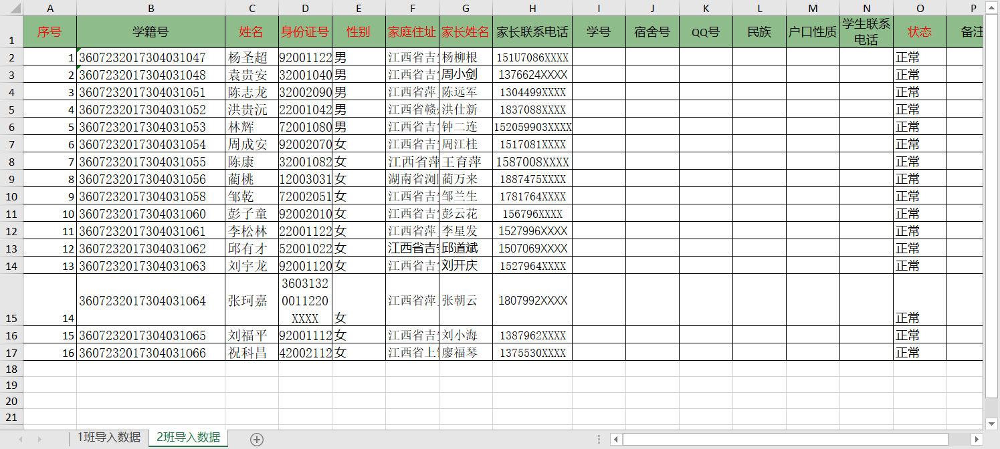
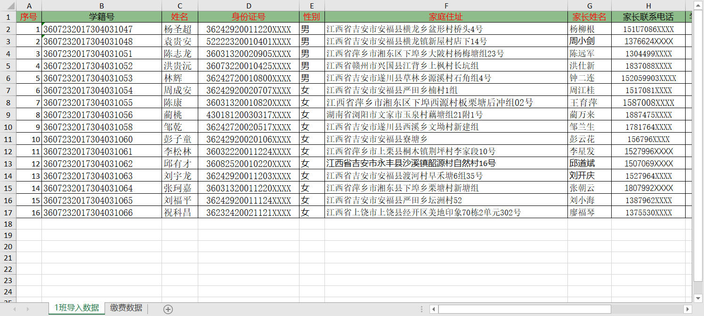
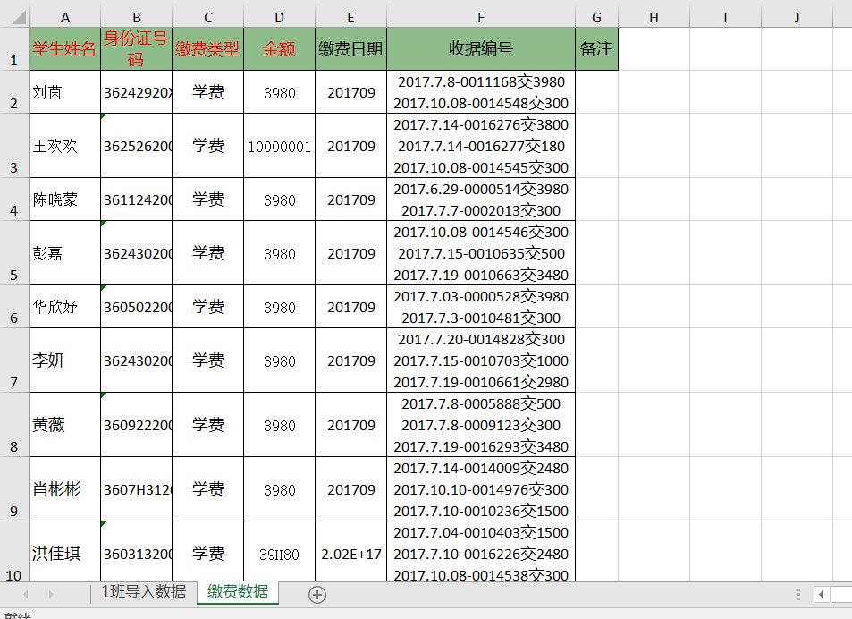

# Import Multi-Sheet Tutorial

## Description

This tutorial  explains how to use Magicodes.IE.Excel complete the Excel import of multiple Sheet data.

## Main points

- Multiple Sheet data import in the same format
- Multiple Sheet data import in different formats

## Main steps

### 1. Multiple Sheet data import in the same format

#### 1.1 Create Dto for importing Sheets

The main code is shown below:

- Student Data Dto

  ```c#      
    /// <summary>
    /// Importing Student Data Dto
    /// IsLabelingError：Whether to mark data errors
    /// </summary>
    [ExcelImporter(IsLabelingError = true)]
    public class ImportStudentDto
    {
        /// <summary>
        ///     序号
        /// </summary>
        [ImporterHeader(Name = "序号")]
        public long SerialNumber { get; set; }

        /// <summary>
        ///     学籍号
        /// </summary>
        [ImporterHeader(Name = "学籍号", IsAllowRepeat = false)]
        [MaxLength(30, ErrorMessage = "学籍号字数超出最大限制,请修改!")]
        public string StudentCode { get; set; }

        /// <summary>
        ///     姓名
        /// </summary>
        [ImporterHeader(Name = "姓名")]
        [Required(ErrorMessage = "学生姓名不能为空")]
        [MaxLength(50, ErrorMessage = "名称字数超出最大限制,请修改!")]
        public string Name { get; set; }

        /// <summary>
        ///     身份证号码
        /// </summary>
        [ImporterHeader(Name = "身份证号", IsAllowRepeat = false)]
        [Required(ErrorMessage = "身份证号不能为空")]
        [MaxLength(18, ErrorMessage = "身份证字数超出最大限制,请修改!")]
        public string IdCard { get; set; }

        /// <summary>
        ///     性别
        /// </summary>
        [ImporterHeader(Name = "性别")]
        [Required(ErrorMessage = "性别不能为空")]
        [ValueMapping("男", 0)]
        [ValueMapping("女", 1)]
        public Genders Gender { get; set; }

        /// <summary>
        ///     家庭地址
        /// </summary>
        [ImporterHeader(Name = "家庭住址")]
        [Required(ErrorMessage = "家庭地址不能为空")]
        [MaxLength(200, ErrorMessage = "家庭地址字数超出最大限制,请修改!")]
        public string Address { get; set; }

        /// <summary>
        ///     家长姓名
        /// </summary>
        [ImporterHeader(Name = "家长姓名")]
        [Required(ErrorMessage = "家长姓名不能为空")]
        [MaxLength(50, ErrorMessage = "家长姓名数超出最大限制,请修改!")]
        public string Guardian { get; set; }

        /// <summary>
        ///     家长联系电话
        /// </summary>
        [ImporterHeader(Name = "家长联系电话")]
        [MaxLength(20, ErrorMessage = "家长联系电话字数超出最大限制,请修改!")]
        public string GuardianPhone { get; set; }

        /// <summary>
        ///     学号
        /// </summary>
        [ImporterHeader(Name = "学号")]
        [MaxLength(30, ErrorMessage = "学号字数超出最大限制,请修改!")]
        public string StudentNub { get; set; }

        /// <summary>
        ///     宿舍号
        /// </summary>
        [ImporterHeader(Name = "宿舍号")]
        [MaxLength(20, ErrorMessage = "宿舍号字数超出最大限制,请修改!")]
        public string DormitoryNo { get; set; }

        /// <summary>
        ///     QQ
        /// </summary>
        [ImporterHeader(Name = "QQ号")]
        [MaxLength(30, ErrorMessage = "QQ号字数超出最大限制,请修改!")]
        public string QQ { get; set; }

        /// <summary>
        ///     民族
        /// </summary>
        [ImporterHeader(Name = "民族")]
        [MaxLength(2, ErrorMessage = "民族字数超出最大限制,请修改!")]
        public string Nation { get; set; }

        /// <summary>
        ///     户口性质
        /// </summary>
        [ImporterHeader(Name = "户口性质")]
        [MaxLength(10, ErrorMessage = "户口性质字数超出最大限制,请修改!")]
        public string HouseholdType { get; set; }

        /// <summary>
        ///     联系电话
        /// </summary>
        [ImporterHeader(Name = "学生联系电话")]
        [MaxLength(20, ErrorMessage = "手机号码字数超出最大限制,请修改!")]
        public string Phone { get; set; }

        /// <summary>
        ///     状态
        ///     测试可为空的枚举类型
        /// </summary>
        [ImporterHeader(Name = "状态")] 
        public StudentStatus? Status { get; set; }

        /// <summary>
        ///     备注
        /// </summary>
        [ImporterHeader(Name = "备注")]
        [MaxLength(200, ErrorMessage = "备注字数超出最大限制,请修改!")]
        public string Remark { get; set; }

        /// <summary>
        ///     是否住校(宿舍)
        /// </summary>
        [ImporterHeader(IsIgnore = true)]
        public bool? IsBoarding { get; set; }

        /// <summary>
        ///     所属班级id
        /// </summary>
        [ImporterHeader(IsIgnore = true)]
        public Guid ClassId { get; set; }

        /// <summary>
        ///     学校Id
        /// </summary>
        [ImporterHeader(IsIgnore = true)]
        public Guid? SchoolId { get; set; }

        /// <summary>
        ///     校区Id
        /// </summary>
        [ImporterHeader(IsIgnore = true)]
        public Guid? CampusId { get; set; }

        /// <summary>
        ///     专业Id
        /// </summary>
        [ImporterHeader(IsIgnore = true)]
        public Guid? MajorsId { get; set; }

        /// <summary>
        ///     年级Id
        /// </summary>
        [ImporterHeader(IsIgnore = true)]
        public Guid? GradeId { get; set; }
    }

  ```


#### 1.2 Create Import Excel Dto

The main code is shown below:

- Student Data Dto

  ```c#  
    public class ImportClassStudentDto
    {

        [ExcelImporter(SheetName = "1班导入数据")]
        public ImportStudentDto Class1Students { get; set; }

        [ExcelImporter(SheetName = "2班导入数据")]
        public ImportStudentDto Class2Students { get; set; }

    }
  ```
  As shown in the above code, we define the class student data Dto, the main considerations are as follows:

  1. Excel的Dto类上面 不用导入相关的加特性。
  1. Excel's Dto class does not need to import relevant additive features on top
  2. Excel的Dto类里面的属性未Sheet的Dto类型，ExcelImporter特性离的SheetName参数来设置具体某一个Sheet名。
  2. Excel's Dto class inside the property not Sheet's Dto type, ExcelImporter characteristics away from the SheetName parameter to set a specific Sheet name.

#### 1.3 Excel templates

Note: Multiple Sheet column names in Excel must be consistent (corresponding to the same Sheet Dto type)

Template Directory：src\Magicodes.ExporterAndImporter.Tests\TestFiles\Import\班级学生基础数据导入.xlsx

First Sheet:


Second Sheet:



#### 1.4 Import Code


```c#
IExcelImporter Importer = new ExcelImporter();

var filePath = Path.Combine(Directory.GetCurrentDirectory(), "TestFiles", "Import", "班级学生基础数据导入.xlsx");

//The import result is obtained as a dictionary type，Key is Sheet name，Value is Sheet data
var importDic = await Importer.ImportSameSheets<ImportClassStudentDto, ImportStudentDto>(filePath);

//Iterating over the dictionary，Get each Sheet data.
foreach (var item in importDic)
{
    var import = item.Value;
    //导入的Sheet数据
    var studentList = import.Data.ToList();
}
```


### 2. Multiple Sheet data import in different formats

#### 2.1 Create Import Sheet's Dto

The main code is shown below：

- Student data Dto the same as above

- Payment Log Data Dto ：

  ```c#    
    /// <summary>
    ///     缴费日志导入Dto
    /// </summary>
    /// <autogeneratedoc />
    [ExcelImporter(IsLabelingError = true)]
    public class ImportPaymentLogDto
    {
        /// <summary>
        ///     学生姓名
        /// </summary>
        [ImporterHeader(Name = "学生姓名")]
        [Required(ErrorMessage = "学生姓名为必填项")]
        [MaxLength(30, ErrorMessage = "学生姓名不能超过15位")]
        public string Name { get; set; }

        /// <summary>
        ///     身份证号码
        /// </summary>
        [ImporterHeader(Name = "身份证号码")]
        [Required(ErrorMessage = "身份证号码为必填项")]
        [MaxLength(18, ErrorMessage = "身份证号码不能超过18位")]
        [MinLength(18, ErrorMessage = "身份证号码不能小于18位")]
        public string IdCard { get; set; }

        /// <summary>
        ///     缴费类型
        /// </summary>
        [ImporterHeader(Name = "缴费类型")]
        [Required(ErrorMessage = "缴费类型为必填项")]
        public string CostType { get; set; }

        /// <summary>
        ///     金额
        /// </summary>
        [ImporterHeader(Name = "金额")]
        [Range(0.01, 1000000, ErrorMessage = "收费金额区间为1~100万")]
        [Required(ErrorMessage = "金额为必填项")]
        public decimal Amount { get; set; }

        /// <summary>
        ///     缴费日期
        /// </summary>
        [ImporterHeader(Name = "缴费日期")]
        [MaxLength(8, ErrorMessage = "缴费日期不能超过8位")]
        [RegularExpression("\\d{6,8}", ErrorMessage = "缴费日期只能输入6到8位数字例如201908/20190815")]
        public string PayDate { get; set; }

        /// <summary>
        ///     收据编号
        ///     多个使用逗号分隔，仅线下收据
        /// </summary>
        [ImporterHeader(Name = "收据编号")]
        [MaxLength(200, ErrorMessage = "收据编号不能超过200位")]
        public string ReceiptCodes { get; set; }

        /// <summary>
        ///     备注
        /// </summary>
        [ImporterHeader(Name = "备注")]
        [MaxLength(500, ErrorMessage = "备注不能超过500位")]
        public string Remarks { get; set; }

        /// <summary>
        ///     创建时间
        /// </summary>
        [ImporterHeader(IsIgnore = true)]
        public DateTime? CreationTime { get; set; }

        /// <summary>
        ///     收费项目id
        /// </summary>
        [ImporterHeader(IsIgnore = true)]
        public int? ChargeProjectId { get; set; }

        /// <summary>
        ///     班级Id
        /// </summary>
        [ImporterHeader(IsIgnore = true)]
        public Guid? ClassId { get; set; }

        /// <summary>
        ///     班级名称
        /// </summary>
        [ImporterHeader(IsIgnore = true)]
        public string ClassName { get; set; }

        /// <summary>
        ///     年级Id
        /// </summary>
        [ImporterHeader(IsIgnore = true)]
        public Guid? GradeId { get; set; }

        /// <summary>
        ///     年级信息
        /// </summary>
        [ImporterHeader(IsIgnore = true)]
        public string GradeName { get; set; }

        /// <summary>
        ///     专业Id
        /// </summary>
        [ImporterHeader(IsIgnore = true)]
        public Guid? MajorId { get; set; }

        /// <summary>
        ///     专业信息
        /// </summary>
        [ImporterHeader(IsIgnore = true)]
        public string MajorName { get; set; }

        /// <summary>
        ///     校区Id
        /// </summary>
        [ImporterHeader(IsIgnore = true)]
        public Guid? CampusId { get; set; }

        /// <summary>
        ///     校区名称
        /// </summary>
        [ImporterHeader(IsIgnore = true)]
        public string CampusName { get; set; }

        /// <summary>
        ///     学校Id
        /// </summary>
        [ImporterHeader(IsIgnore = true)]
        public Guid? SchoolId { get; set; }

        /// <summary>
        ///     学校信息
        /// </summary>
        [ImporterHeader(IsIgnore = true)]
        public string SchoolName { get; set; }
    }
  ```


#### 2.2 Create an import Excel into Dto

The main code is shown below：

- Class student basic data and payment flow data Dto

  ```c#      
    public  class ImportStudentAndPaymentLogDto
    {
        [ExcelImporter(SheetName = "1班导入数据")]
        public ImportStudentDto Class1Students { get; set; }

        [ExcelImporter(SheetName = "缴费数据")]
        public ImportPaymentLogDto Class2Students { get; set; }
    }
  ```
  

#### 2.3 Excel templates


Template Directory：src\Magicodes.ExporterAndImporter.Tests\TestFiles\Import\学生基础数据及缴费流水号导入.xlsx

Student Basic Data Sheet:


Payment flow number Sheet:



#### 2.4 Import Code


```c#
IExcelImporter Importer = new ExcelImporter();

var filePath = Path.Combine(Directory.GetCurrentDirectory(), "TestFiles", "Import", "学生基础数据及缴费流水号导入.xlsx");

//获取到的导入结果为一个字典类型，Key为Sheet名，Value为Sheet对应的数据
var importDic = await Importer.ImportMultipleSheet<ImportStudentAndPaymentLogDto>(filePath);

//遍历字典，获取每个Sheet的数据
foreach (var item in importDic)
{
    var import = item.Value;
    //导入的Sheet数据，
    if (item.Key == "1班导入数据")
    {
        //多个不同类型的Sheet返回的值为object，需要进行类型转换
        ImportStudentDto dto = (ImportStudentDto) import.Data.ElementAt(0);
    }
    if (item.Key == "缴费数据")
    {
        ImportPaymentLogDto dto = (ImportPaymentLogDto)import.Data.ElementAt(0);
    }
}
```

