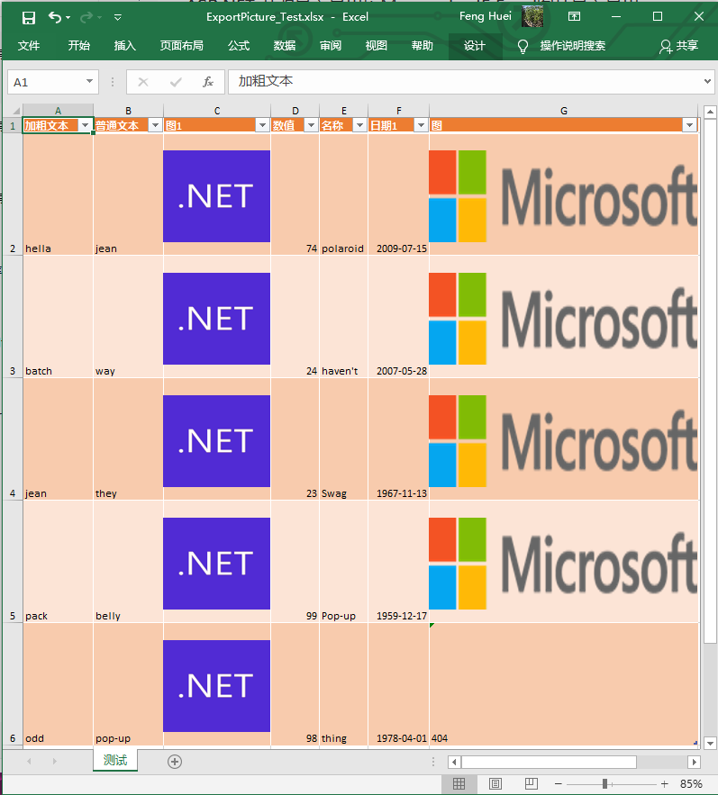
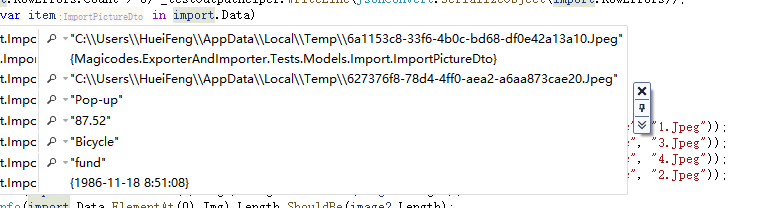

# use Magicodes.IE.Excel Import and export Excel as pictures

## Description

This chapter of the tutorial explains how to use Magicodes.IE.Excel to import and export images.

## Main points

- Configuring DTO for Excel Image Export
- Configuring DTO for Excel image import

## Image Import and Export Feature Description

### ExportImageFieldAttribute

+ **Height**： Height(Default 15)
+ **Width**：Width(Default 50)
+ **Alt**：Replace text when image does not exist
+ **YOffset**：垂直偏移（可进行移动图片）
+ **XOffset**：水平偏移（可进行移动图片）

### ImportImageFieldAttribute

+ **ImageDirectory**：  Image storage path (stored to temporary directory by default) 
+ **ImportImageTo**：Image export method (default Base64), the supported methods are shown below：
```csharp
    /// <summary>
    ///     图片导入类型
    /// </summary>
    public enum ImportImageTo
    {
        /// <summary>
        ///     导入到临时目录
        /// </summary>
        TempFolder,

        /// <summary>
        ///     导入为base64格式
        /// </summary>
        Base64
    }
```

## Main steps


### 1.Installation package Magicodes.IE.Excel

```powershell
Install-Package Magicodes.IE.Excel
```

### 2.Export images to Excel using Magicodes.IE.Excel.

As shown in the following sample code, we need to add to the image property - **ExportImageFieldAttribute** ，Using the “Width” property set the width of the image，“Height” property set the height of the image，“Alt” property set Replace text ，This text will be displayed when the image does not exist：

```csharp
   [ExcelExporter(Name = "测试")]
    public class ExportTestDataWithPicture
    {
        [ExporterHeader(DisplayName = "加粗文本", IsBold = true)]
        public string Text { get; set; }

        [ExporterHeader(DisplayName = "普通文本")] public string Text2 { get; set; }
        [ExporterHeader(DisplayName = "忽略", IsIgnore = true)]
        public string Text3 { get; set; }

        [ExportImageField(Width = 20, Height = 120)]
        [ExporterHeader(DisplayName = "图1")]
        public string Img1 { get; set; }
        [ExporterHeader(DisplayName = "数值", Format = "#,##0")]
        public decimal Number { get; set; }
        [ExporterHeader(DisplayName = "名称", IsAutoFit = true)]
        public string Name { get; set; }
        /// <summary>
        /// 时间测试
        /// </summary>
        [ExporterHeader(DisplayName = "日期1", Format = "yyyy-MM-dd")]
        public DateTime Time1 { get; set; }

        [ExportImageField(Width = 50, Height = 120, Alt = "404")]
        [ExporterHeader(DisplayName = "图", IsAutoFit = false)]
        public string Img { get; set; }
    }
```
It is worth noting that:

+ `ExportImageFieldAttribute`Features are required
+ Image property type must be string type, support local image and remote image address

Next, we can use the API to perform the export. In fact, besides the difference in Dto, the export API is still one, as shown in the following code：

```csharp
        public async Task ExportPicture_Test()
        {
            IExporter exporter = new ExcelExporter();
            var url = Path.Combine("TestFiles", "ExporterTest.png");
            for (var i = 0; i < data.Count; i++)
            {
                var item = data[i];
                item.Img1 = url;
                if (i == 4)
                    item.Img = null;
                else
                    item.Img = "https://docs.microsoft.com/en-us/media/microsoft-logo-dark.png";
            }
            var result = await exporter.Export(filePath, data);
        }
```
As shown in the code above, the current image export can be set to a remote image address, as well as a local image address, and can also be set to null (null will be replaced by alternative text). The result is as follows：



### 3.Import images using  Magicodes.IE.Excel

IE.Excel supports importing images from Excel, just by using the feature "ImportImageField". It supports two import methods：

+ Import to temporary directory
+ Import as Base64

Only the ImportImageTo property needs to be set。

**ImportImageTo枚举**
- **Base64**  Import to base64 format

- **TempFolder** Import to temporary directory

It is worth noting that, as above, only string types are supported for image property field types。

#### Prepare the Excel containing the images to be imported

Before we start, we need to prepare the imported Excel, the template in this example is shown below：


You can find this file in the "TestFiles" directory of the unit test. Next, we will use this file to demonstrate the Excel image import。

#### Import to temporary directory

The Dto model is shown below:
```csharp

    public class ImportPictureDto
    {
        [ImporterHeader(Name = "加粗文本")]
        public string Text { get; set; }
        [ImporterHeader(Name = "普通文本")]
        public string Text2 { get; set; }

        /// <summary>
        /// 将图片写入到临时目录
        /// </summary>
        [ImportImageField(ImportImageTo = ImportImageTo.TempFolder)]
        [ImporterHeader(Name = "图1")]
        public string Img1 { get; set; }
        [ImporterHeader(Name = "数值")]
        public string Number { get; set; }
        [ImporterHeader(Name = "名称")]
        public string Name { get; set; }
        [ImporterHeader(Name = "日期")]
        public DateTime Time { get; set; }

        /// <summary>
        /// 将图片写入到临时目录
        /// </summary>
        [ImportImageField(ImportImageTo = ImportImageTo.TempFolder)]
        [ImporterHeader(Name = "图")]
        public string Img { get; set; }
    }

```
The original import method is used, but the Dto settings have changed：

```csharp
        public async Task ImportPicture_Test()
        {
            var filePath = Path.Combine(Directory.GetCurrentDirectory(), "TestFiles", "Import", "图片导入模板.xlsx");
            var import = await Importer.Import<ImportPictureDto>(filePath);
            if (import.Exception != null) _testOutputHelper.WriteLine(import.Exception.ToString());

            if (import.RowErrors.Count > 0) _testOutputHelper.WriteLine(JsonConvert.SerializeObject(import.RowErrors));
        }

```
As shown in the figure below, the pictures in Excel will be imported to the temporary directory. Noteworthy:
+ **After the images are imported to the temporary directory, if the import results meet the business needs, please immediately move the images to the official storage location, such as web directory, cloud storage, etc.；**
+ Image import also supports specified locations, but it is not recommended。




#### Import images as base64

To import an image as base64, simply set the "ImportImageTo" property to the value "ImportImageTo.Base64":
```csharp

    public class ImportPictureBase64Dto
    {
        [ImporterHeader(Name = "加粗文本")]
        public string Text { get; set; }
        [ImporterHeader(Name = "普通文本")]
        public string Text2 { get; set; }

        /// <summary>
        /// 将图片导入为base64（默认为base64）
        /// </summary>
        [ImportImageField(ImportImageTo = ImportImageTo.Base64)]
        [ImporterHeader(Name = "图1")]
        public string Img1 { get; set; }

        [ImporterHeader(Name = "数值")]
        public string Number { get; set; }
        [ImporterHeader(Name = "名称")]
        public string Name { get; set; }
        [ImporterHeader(Name = "日期")]
        public DateTime Time { get; set; }

        /// <summary>
        /// 将图片导入到临时目录
        /// </summary>
        [ImportImageField(ImportImageTo = ImportImageTo.TempFolder)]
        [ImporterHeader(Name = "图")]
        public string Img { get; set; }
    }

```
Import code as above:
```csharp

public async Task ImportPictureBase64_Test()
        {
            var filePath = Path.Combine(Directory.GetCurrentDirectory(), "TestFiles", "Import", "图片导入模板.xlsx");
            var import = await Importer.Import<ImportPictureBase64Dto>(filePath);
        }

```
As shown in the figure below, we can easily get the base64 encoded result of the image：


## Reference

https://github.com/dotnetcore/Magicodes.IE

**Magicodes.IE：Import and export universal libraries, support Dto import and export, template export, fancy export and dynamic export, support Excel, Csv, Word, Pdf and Html.**

- Github：<https://github.com/dotnetcore/Magicodes.IE>
- Gitee（Unscheduled synchronization, no maintenance）：<https://gitee.com/magicodes/Magicodes.IE>


