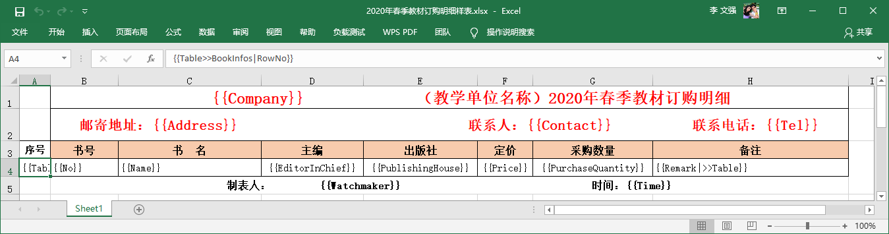
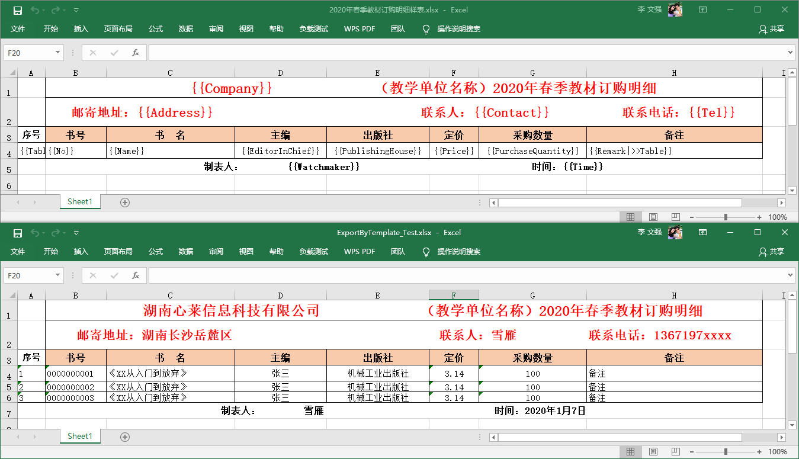

# Excel模板导出之导出教材订购表

## 说明

本教程主要说明如果使用Magicodes.IE.Excel完成教材订购表的Excel模板导出。

## 要点

- 本教程使用Magicodes.IE.Excel来完成Excel模板导出
- 需要通过创建Dto来完成导出
- 需要按要求准备Excel模板

## 主要步骤

### 1.安装包Magicodes.IE.Excel

在本篇教程中，我们仅演示使用Excel来完成学生数据的导入。我们需要在已准备好的工程中安装以下包，参考命令如下所示：

```powershell
Install-Package Magicodes.IE.Excel
```

### 2.准备模板

Magicodes.IE.Excel模板导出支持单元格渲染和表格渲染：

- 单元格渲染

  语法：

  ```
  {{Company}}             （教学单位名称）2020年春季教材订购明细
  {{Table>>BookInfos|RowNo}} //表格渲染开始语法
  {{Remark|>>Table}}//表格渲染结束语法
  {{Image::ImageUrl?Width=50&Height=120&Alt=404}} //图片渲染
  {{Image::ImageUrl?w=50&h=120&Alt=404}} //图片渲染
  {{Image::ImageUrl?Alt=404}} //图片渲染
  ```

  注意：

  - 双大括号是必须的
  - 暂不支持表达式等
  - 支持子对象属性
  - 大小写敏感

  

- 表格渲染

| 序号                        | 书号   | 书 名    | 主编              | 出版社              | 定价      | 采购数量             | 备注                |
| --------------------------- | ------ | -------- | ----------------- | ------------------- | --------- | -------------------- | ------------------- |
| {{Table>>BookInfos\|RowNo}} | {{No}} | {{Name}} | {{EditorInChief}} | {{PublishingHouse}} | {{Price}} | {{PurchaseQuantity}} | {{Remark\|>>Table}} |

表格渲染的格式如上所述：

- 渲染语法以“Table>>BookInfos|”为开始，其中“BookInfos”为列表属性

- “RowNo”、“No”等均为列表字段

- 必须以“|>>Table”结尾

- 暂不支持一行多个Table（即将支持，具体请查看日志）

  

根据以上语法，我们可以编写模板如下所示：



### 3.创建导出Dto

主要代码如下所示：

- 教材订购信息Dto

  ```c#
      /// <summary>
      /// 教材订购信息
      /// </summary>
      public class TextbookOrderInfo
      {
          /// <summary>
          /// 公司名称
          /// </summary>
          public string Company { get; }
  
          /// <summary>
          /// 地址
          /// </summary>
          public string Address { get; }
  
          /// <summary>
          /// 联系人
          /// </summary>
          public string Contact { get; }
  
          /// <summary>
          /// 电话
          /// </summary>
          public string Tel { get; }
  
          /// <summary>
          /// 制表人
          /// </summary>
          public string Watchmaker { get; }
  
          /// <summary>
          /// 时间
          /// </summary>
          public string Time { get; }
  
          /// <summary>
          /// 教材信息列表
          /// </summary>
          public List<BookInfo> BookInfos { get; }
  
          public TextbookOrderInfo(string company, string address, string contact, string tel, string watchmaker, string time, List<BookInfo> bookInfo)
          {
              Company = company;
              Address = address;
              Contact = contact;
              Tel = tel;
              Watchmaker = watchmaker;
              Time = time;
              BookInfos = bookInfo;
          }
      }
  ```
  如上述代码所示，定义的结构基本上和模板一致。其中属性BookInfos对应列表，具体定义如下所示。
  
- 教材信息Dto：

  ```c#
      /// <summary>
      /// 教材信息
      /// </summary>
      public class BookInfo
      {
          /// <summary>
          /// 行号
          /// </summary>
          public int RowNo { get; }
  
          /// <summary>
          /// 书号
          /// </summary>
          public string No { get; }
  
          /// <summary>
          /// 书名
          /// </summary>
          public string Name { get; }
  
          /// <summary>
          /// 主编
          /// </summary>
          public string EditorInChief { get; }
  
          /// <summary>
          /// 出版社
          /// </summary>
          public string PublishingHouse { get; }
  
          /// <summary>
          /// 定价
          /// </summary>
          public string Price { get; }
  
          /// <summary>
          /// 采购数量
          /// </summary>
          public int PurchaseQuantity { get; }
  
          /// <summary>
          /// 备注
          /// </summary>
          public string Remark { get; }
  
          public BookInfo(int rowNo, string no, string name, string editorInChief, string publishingHouse, string price, int purchaseQuantity, string remark)
          {
              RowNo = rowNo;
              No = no;
              Name = name;
              EditorInChief = editorInChief;
              PublishingHouse = publishingHouse;
              Price = price;
              PurchaseQuantity = purchaseQuantity;
              Remark = remark;
          }
      }
  ```
  


### 4.导出

接下来直接调用Magicodes.IE.Excel封装的模板导出方法，该方法实现自接口IExportFileByTemplate：

```c#
    /// <summary>
    /// 根据模板导出文件
    /// </summary>
    public interface IExportFileByTemplate
    {
        /// <summary>
        ///     根据模板导出
        /// </summary>
        /// <typeparam name="T"></typeparam>
        /// <param name="fileName"></param>
        /// <param name="data"></param>
        /// <param name="template">HTML模板或模板路径</param>
        /// <returns></returns>
        Task<ExportFileInfo> ExportByTemplate<T>(string fileName, T data,
            string template) where T : class;
    }
```

通过以上方法中的ExportByTemplate，我们就可以完成Excel模板导出。具体使用可以参考以下单元测试：

```c#
[Fact(DisplayName = "Excel模板导出教材订购明细样表")]
public async Task ExportByTemplate_Test()
{
    //模板路径
    var tplPath = Path.Combine(Directory.GetCurrentDirectory(), "TestFiles", "ExportTemplates",
        "2020年春季教材订购明细样表.xlsx");
    //创建Excel导出对象
    IExportFileByTemplate exporter = new ExcelExporter();
    //导出路径
    var filePath = Path.Combine(Directory.GetCurrentDirectory(), nameof(ExportByTemplate_Test) + ".xlsx");
    if (File.Exists(filePath)) File.Delete(filePath);
    //根据模板导出
    await exporter.ExportByTemplate(filePath,
        new TextbookOrderInfo("湖南心莱信息科技有限公司", "湖南长沙岳麓区", "雪雁", "1367197xxxx", "雪雁", DateTime.Now.ToLongDateString(),
            new List<BookInfo>()
            {
                new BookInfo(1, "0000000001", "《XX从入门到放弃》", "张三", "机械工业出版社", "3.14", 100, "备注"),
                new BookInfo(2, "0000000002", "《XX从入门到放弃》", "张三", "机械工业出版社", "3.14", 100, "备注"),
                new BookInfo(3, "0000000003", "《XX从入门到放弃》", "张三", "机械工业出版社", "3.14", 100, "备注")
            }),
        tplPath);
}

```

结果如下图所示：




## 最后

整个Excel模板导出教程就此结束了，由于仓促完成，还有许多地方可以改善并优化。

**相关库会一直更新，在功能体验上有可能会和本文教程有细微的出入，请以相关具体代码、版本日志、单元测试示例为准。**
