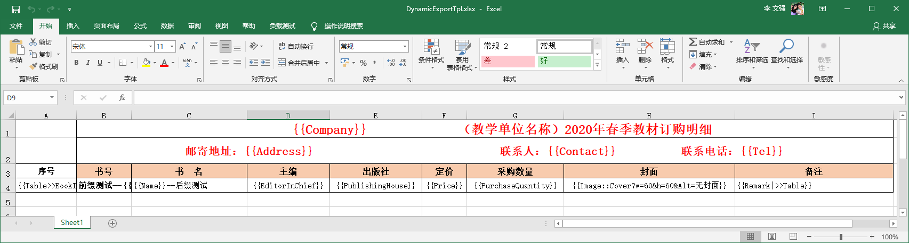
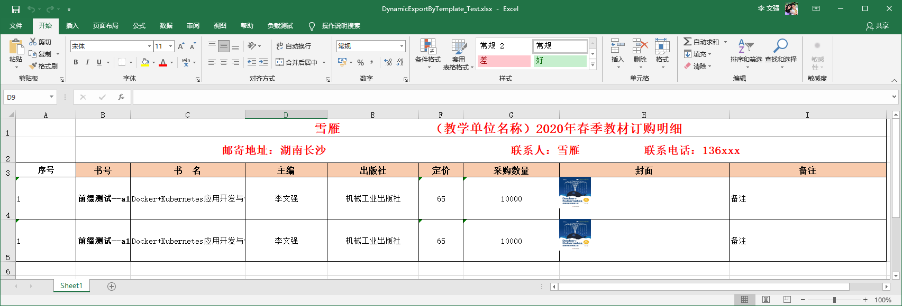

# Excel template  export - dynamic export

## Description

Magicodes.IE currently supports Excel template export using `JObject`, `Dictionary` and `ExpandoObject` for dynamic export, Please follow this tutorial for details.

The idea of this function, part of the implementation initially originated from [arik](https://gitee.com/arik) ,Thanks again[arik](https://gitee.com/arik)！

开始本篇教程前，我们重温一下模板导出的语法：

```
  {{Company}}  //Cell rendering
  {{Table>>BookInfos|RowNo}} //Table rendering start syntax
  {{Remark|>>Table}}//Table rendering end syntax
  {{Image::ImageUrl?Width=50&Height=120&Alt=404}} //Image Rendering
  {{Image::ImageUrl?w=50&h=120&Alt=404}} //Image Rendering
  {{Image::ImageUrl?Alt=404}} //Image Rendering
  {{Formula::AVERAGE?params=G4:G6}}  //Formula Rendering
  {{Formula::SUM?params=G4:G6&G4}}   //Formula Rendering
```

If you are not familiar with Magicodes.IE's template export, please read the following tutorial.

[Excel template export-Export textbook order form ](9.Excel template export-Export textbook order form.md)

Next, we begin this tutorial.

## 1. Installation package Magicodes.IE.Excel

```powershell
Install-Package Magicodes.IE.Excel
```

## 2. Prepare the Excel template file

For example, the following chart.



This file can be found in the test project with the file name【DynamicExportTpl.xlsx】。

## 3. Use JObject to complete dynamic export

The code is relatively simple and is shown below.

```csharp
    string json = @"{
      'Company': '雪雁',
      'Address': '湖南长沙',
      'Contact': '雪雁',
      'Tel': '136xxx',
      'BookInfos': [
        {'No':'a1','RowNo':1,'Name':'Docker+Kubernetes应用开发与快速上云','EditorInChief':'李文强','PublishingHouse':'机械工业出版社','Price':65,'PurchaseQuantity':10000,'Cover':'https://img9.doubanio.com/view/ark_article_cover/retina/public/135025435.jpg?v=1585121965','Remark':'备注'},
        {'No':'a1','RowNo':1,'Name':'Docker+Kubernetes应用开发与快速上云','EditorInChief':'李文强','PublishingHouse':'机械工业出版社','Price':65,'PurchaseQuantity':10000,'Cover':'https://img9.doubanio.com/view/ark_article_cover/retina/public/135025435.jpg?v=1585121965','Remark':'备注'}
      ]
    }";
    var jobj = JObject.Parse(json);
    //Template Path
    var tplPath = Path.Combine(Directory.GetCurrentDirectory(), "TestFiles", "ExportTemplates",
        "DynamicExportTpl.xlsx");
    //Creating Excel Export Objects
    IExportFileByTemplate exporter = new ExcelExporter();
    //Export Path
    var filePath = Path.Combine(Directory.GetCurrentDirectory(), nameof(DynamicExportByTemplate_Test) + ".xlsx");
    if (File.Exists(filePath)) File.Delete(filePath);

    //Export from template
    await exporter.ExportByTemplate(filePath, jobj, tplPath);

```
The above code you can find in the unit test `DynamicExportWithJObjectByTemplate_Test`

**It is worth noting that since the `JObject` ，So you need to press the package when using `Newtonsoft.Json`. But，`Magicodes.IE.Excel`Not inherently dependent `Newtonsoft.Json`。**

Currently, the dynamic export of Excel templates is only supported through `JObject` objects, and more dynamic methods will be supported in the future.

After running, you can see the results as shown in the following figure.



## 11. Use Dictionary<string, object> to complete the dynamic export

The exported code is the same as above, except that the data structure uses `Dictionary`

```csharp
var data = new Dictionary<string, object>()
{
    { "Company","雪雁" },
    { "Address", "湖南长沙" },
    { "Contact", "雪雁" },
    { "Tel", "136xxx" },
    { "BookInfos",new List<Dictionary<string,object>>()
        {
            new Dictionary<string, object>()
            {
                {"No","A1" },
                {"RowNo",1 },
                {"Name","Docker+Kubernetes应用开发与快速上云" },
                {"EditorInChief","李文强" },
                {"PublishingHouse","机械工业出版社" },
                {"Price",65 },
                {"PurchaseQuantity",50000 },
                {"Cover","https://img9.doubanio.com/view/ark_article_cover/retina/public/135025435.jpg?v=1585121965" },
                {"Remark","买起" }
            },
            new Dictionary<string, object>()
            {
                {"No","A2" },
                {"RowNo",2 },
                {"Name","Docker+Kubernetes应用开发与快速上云" },
                {"EditorInChief","李文强" },
                {"PublishingHouse","机械工业出版社" },
                {"Price",65 },
                {"PurchaseQuantity",50000 },
                {"Cover","https://img9.doubanio.com/view/ark_article_cover/retina/public/135025435.jpg?v=1585121965" },
                {"Remark","k8s真香" }
            }
        }
    }
};
//Template Path
var tplPath = Path.Combine(Directory.GetCurrentDirectory(), "TestFiles", "ExportTemplates",
    "DynamicExportTpl.xlsx");
//Creating Excel Export Objects
IExportFileByTemplate exporter = new ExcelExporter();
//Export Path
var filePath = Path.Combine(Directory.GetCurrentDirectory(), nameof(DynamicExportWithDictionaryByTemplate_Test) + ".xlsx");
if (File.Exists(filePath)) File.Delete(filePath);

//Export from template
await exporter.ExportByTemplate(filePath, data, tplPath);
```

Specific Code `DynamicExportWithDictionaryByTemplate_Test`。

## 5. Use ExpandoObject to complete dynamic export

As above, the code is shown below.

```csharp
dynamic data = new ExpandoObject();
data.Company = "雪雁";
data.Address = "湖南长沙";
data.Contact = "雪雁";
data.Tel = "136xxx";
data.BookInfos = new List<ExpandoObject>() { };

dynamic book1 = new ExpandoObject();
book1.No = "A1";
book1.RowNo = 1;
book1.Name = "Docker+Kubernetes应用开发与快速上云";
book1.EditorInChief = "李文强";
book1.PublishingHouse = "机械工业出版社";
book1.Price = 65;
book1.PurchaseQuantity = 50000;
book1.Cover = "https://img9.doubanio.com/view/ark_article_cover/retina/public/135025435.jpg?v=1585121965";
book1.Remark = "买买买";
data.BookInfos.Add(book1);

dynamic book2 = new ExpandoObject();
book2.No = "A2";
book2.RowNo = 2;
book2.Name = "Docker+Kubernetes应用开发与快速上云";
book2.EditorInChief = "李文强";
book2.PublishingHouse = "机械工业出版社";
book2.Price = 65;
book2.PurchaseQuantity = 50000;
book2.Cover = "https://img9.doubanio.com/view/ark_article_cover/retina/public/135025435.jpg?v=1585121965";
book2.Remark = "买买买";
data.BookInfos.Add(book2);

//Template Path
var tplPath = Path.Combine(Directory.GetCurrentDirectory(), "TestFiles", "ExportTemplates",
    "DynamicExportTpl.xlsx");
//Creating Excel Export Objects
IExportFileByTemplate exporter = new ExcelExporter();
//Export Path
var filePath = Path.Combine(Directory.GetCurrentDirectory(), nameof(DynamicExportWithExpandoObjectByTemplate_Test) + ".xlsx");
if (File.Exists(filePath)) File.Delete(filePath);

//Export according to template
await exporter.ExportByTemplate(filePath, data, tplPath);
```

Specific code view `DynamicExportWithExpandoObjectByTemplate_Test`。

## Finally

This tutorial ends here, if you have questions, please submit more Issue.

**Magicodes.IE：import and export universal libraries, support Dto import and export, template export, fancy export and dynamic export, support Excel, Csv, Word, Pdf and Html.**

- Github：<https://github.com/dotnetcore/Magicodes.IE>
- Gitee（Manual sync, no maintenance）：<https://gitee.com/magicodes/Magicodes.IE>

**The relevant library will be updated all the time, there may be slight differences in functional experience and this tutorial, please refer to the relevant specific code, version logs, unit test examples shall prevail.**